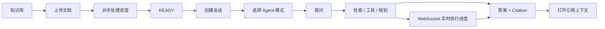

# 多范式 AI Agent 文档智能处理平台

## 前端 UI、交互与前后端接口完整开发手册

> 配套后端主文档：`多范式AI-Agent文档智能处理平台-完整复现开发文档-指标增强版.md`  
> 目标：让编码 Agent 可以按照模块逐项完成一个**真正可使用、可演示、可测试、与后端契约一致**的 Web 前端。  
> 推荐前端目录：`D:\Project\ai-document-agent\frontend`  
> 推荐技术栈：React + TypeScript + Vite + Ant Design + React Router + TanStack Query + Zustand + Axios + Native WebSocket  
> 原则：前端不直接访问 MySQL、Redis、RabbitMQ、Qdrant、Elasticsearch；所有业务能力统一通过 Spring Boot REST / WebSocket 暴露。

---

# 0. 文档定位

这份文档不是 UI 原型说明，而是可以直接交给前端编码 Agent 逐模块实施的施工手册。

它必须和后端主文档一起使用：

- 后端 M00～M20：负责领域逻辑、数据库、RAG、Agent、MQ、恢复、WebSocket、Benchmark。
- 前端 FE00～FE14：负责产品 UI、REST 客户端、状态管理、会话交互、Agent 执行可视化、错误恢复、前端测试和最终部署。

前端开发顺序：

`FE00 → FE01 → FE02 → FE03 → FE04 → FE05 → FE06 → FE07 → FE08 → FE09 → FE10 → FE11 → FE12 → FE13 → FE14`

开发规则：

1. 当前 FE 模块没有通过验收，不进入下一模块。
2. 每次开发前先检查后端接口是否已经完成；未完成时使用 MSW/Mock 数据，不得擅自改变接口契约。
3. 页面必须具备 loading、empty、error、success 四类基本状态。
4. 所有网络请求统一经过 API Client；页面组件禁止直接散落 `fetch`/`axios` 调用。
5. 服务端状态由 TanStack Query 管理；纯 UI/临时状态使用 Zustand 或组件本地状态。
6. WebSocket 只用于实时事件通知，REST 查询始终作为最终权威状态。
7. 不在前端显示、保存或推导模型隐藏思维链，只展示后端允许暴露的结构化步骤摘要、工具调用摘要和状态。
8. 不把 API Key、数据库口令或基础设施管理密码放入前端环境变量。
9. 所有错误提示对用户可理解；内部堆栈、SQL、服务器路径不得显示。
10. 完成模块后至少执行 `npm run typecheck`、`npm run lint` 和本模块测试。

---

# 1. 产品定位与核心用户流程

平台面向科研/知识工作场景，核心用户行为不是“管理数据库”，而是：

1. 创建一个知识库。
2. 上传 PDF / DOCX / TXT 文档。
3. 等待系统异步解析、切块、Embedding、BM25 索引完成。
4. 创建会话并选择 Agent 模式。
5. 提问并查看答案、引用来源和执行进度。
6. 对复杂 Agent 任务查看步骤状态、工具调用摘要，并在失败后恢复。
7. 必要时查看文档处理状态、系统健康状态和 Benchmark 结果。

核心产品闭环：



---

# 2. 前端技术架构

## 2.1 推荐技术栈

| 类别 | 方案 | 用途 |
|---|---|---|
| Framework | React + TypeScript | UI 与类型安全 |
| Build | Vite | 开发服务器与构建 |
| UI | Ant Design | 表格、表单、Modal、Drawer、Upload、Timeline 等 |
| Router | React Router | 页面路由 |
| Server State | TanStack Query | 请求缓存、重试、失效、轮询 |
| UI State | Zustand | 当前知识库、全局 UI 状态等少量客户端状态 |
| HTTP | Axios | REST Client 与 interceptor |
| Schema | Zod（可选但推荐） | 对关键响应做运行时校验 |
| WebSocket | Browser Native WebSocket | Agent / 文档实时事件 |
| Markdown | react-markdown + 安全插件 | Agent 答案渲染 |
| Test | Vitest + Testing Library | 单元与组件测试 |
| E2E | Playwright | 浏览器端到端测试 |
| Mock | MSW | 后端未完成时的契约 Mock |

不要引入 Redux、GraphQL、Next.js、微前端等与当前项目目标无关的复杂度。

## 2.2 前端目录

```text
frontend/
├── package.json
├── vite.config.ts
├── tsconfig.json
├── .env.example
├── src/
│   ├── main.tsx
│   ├── app/
│   │   ├── App.tsx
│   │   ├── router.tsx
│   │   ├── providers.tsx
│   │   └── error-boundary.tsx
│   ├── api/
│   │   ├── client.ts
│   │   ├── contracts.ts
│   │   ├── knowledge-base.api.ts
│   │   ├── document.api.ts
│   │   ├── rag.api.ts
│   │   ├── conversation.api.ts
│   │   ├── execution.api.ts
│   │   └── system.api.ts
│   ├── websocket/
│   │   ├── progress-client.ts
│   │   ├── progress.types.ts
│   │   └── reconnect-policy.ts
│   ├── features/
│   │   ├── dashboard/
│   │   ├── knowledge-base/
│   │   ├── document/
│   │   ├── chat/
│   │   ├── agent-execution/
│   │   └── system/
│   ├── components/
│   │   ├── layout/
│   │   ├── feedback/
│   │   ├── data-display/
│   │   └── form/
│   ├── hooks/
│   ├── stores/
│   ├── utils/
│   ├── styles/
│   └── test/
├── public/
└── e2e/
```

业务优先按 feature 分组，禁止把所有文件堆进全局 `pages/components/services` 三个大目录。

---

# 3. UI 设计系统

## 3.1 整体风格

目标是一个专业的科研 AI 工作台，而不是营销官网。

设计关键词：

- 清晰
- 高信息密度但不拥挤
- Agent 状态可解释
- 引用可追溯
- 文档处理状态直观
- 少动画，多反馈

建议布局：

```text
┌─────────────────────────────────────────────────────────────┐
│ Header：产品名 / 当前知识库 / 系统状态 / 用户区域（预留）     │
├──────────────┬──────────────────────────────────────────────┤
│ Sidebar      │ Breadcrumb / Page Header                    │
│              ├──────────────────────────────────────────────┤
│ 工作台        │                                              │
│ 知识库        │                 Content                      │
│ 智能问答      │                                              │
│ Agent任务     │                                              │
│ 系统状态      │                                              │
│              │                                              │
└──────────────┴──────────────────────────────────────────────┘
```

推荐桌面优先设计，主内容最大宽度不硬性限制，但聊天正文区域控制可读宽度。

## 3.2 语义状态

| 状态 | UI 语义 |
|---|---|
| READY / SUCCEEDED / UP | 成功 |
| UPLOADED / QUEUED / PENDING | 等待 |
| PROCESSING / RUNNING / RETRYING | 处理中 |
| PAUSED | 暂停 |
| FAILED / DOWN | 失败 |
| CANCELLED | 已取消 |
| degraded | 警告 |

前端不得只靠颜色表达状态，必须同时包含图标/文本。

## 3.3 全局反馈组件

必须统一封装：

- `PageLoading`
- `PageError`
- `EmptyState`
- `ErrorResult`
- `ConfirmDeleteModal`
- `StatusTag`
- `RequestErrorAlert`
- `TraceIdCopy`
- `RetryButton`

当后端返回 `traceId` 时，错误 UI 可以提供“复制请求 ID”，方便排查，但默认不展示内部异常详情。

---

# 4. 路由与页面信息架构

## 4.1 路由表

| 路径 | 页面 | 主要能力 |
|---|---|---|
| `/` | Dashboard | 产品入口、知识库/任务概况、系统状态 |
| `/knowledge-bases` | 知识库列表 | 创建、搜索、分页、删除 |
| `/knowledge-bases/:kbId` | 知识库详情 | 基本信息、文档列表、上传、快速提问 |
| `/knowledge-bases/:kbId/documents/:documentId` | 文档详情 | 处理状态、元数据、失败原因、重试、预览 |
| `/knowledge-bases/:kbId/chat` | 新会话 | 选择 Agent 模式并创建会话 |
| `/knowledge-bases/:kbId/chat/:conversationId` | 智能问答 | 多轮消息、引用、Agent 进度 |
| `/agent-executions` | Agent 任务中心 | 查询执行任务、筛选状态 |
| `/agent-executions/:executionId` | Agent 执行详情 | 步骤 Timeline、工具摘要、恢复、取消 |
| `/system` | 系统状态 | 应用健康与依赖状态 |
| `/evaluation` | Benchmark 报告（可选管理页） | 展示 M19A～M19E 最近结果 |

V1 不设计登录页面，因为当前后端主文档尚未定义用户/认证体系。前端必须预留 `AuthProvider`/route guard 扩展点，但不得虚构登录接口。

---

# 5. 页面详细 UI 与交互

## 5.1 Dashboard

### 目标

用户进入系统后 5 秒内知道：系统是否健康、有哪些知识库、最近文档是否处理成功、是否存在失败 Agent 任务。

### 页面结构

```text
PageHeader
  多范式 AI Agent 文档智能处理平台

KPI Row
  [知识库数量] [READY 文档] [处理中] [失败任务]

Main Grid
  ├── 最近知识库
  ├── 最近文档处理
  ├── 最近 Agent Execution
  └── 服务健康状态
```

由于当前后端没有 Dashboard 聚合 API，V1 有两种实现方式：

1. 前端分别调用现有列表接口并在客户端做轻量聚合。
2. 后续新增 `/api/v1/dashboard/summary` 聚合接口以减少请求。

不得为了 Dashboard 强行在 FE00 阶段修改后端。

### 交互

- 点击知识库卡片进入详情。
- 点击失败文档进入文档详情。
- 点击 Agent task 进入 Execution 详情。
- 系统异常时显示明确 Warning，但不影响其他可用模块。

---

## 5.2 知识库列表 `/knowledge-bases`

### 页面元素

顶部：

- 标题“知识库”
- “新建知识库”主按钮
- 名称搜索框（如果后端暂不支持搜索，前端只过滤当前页；后续再补服务端 search）

主体表格：

| 列 | 内容 |
|---|---|
| 名称 | 可点击 |
| 描述 | 超长省略 |
| 创建时间 | 本地格式化 |
| 更新时间 | 本地格式化 |
| 操作 | 进入 / 编辑 / 删除 |

### 新建 Modal

字段：

- `name`：1～128，trim 后不能为空。
- `description`：最大 512。

调用：

`POST /api/v1/knowledge-bases`

### 删除

删除前二次确认。后端若返回“知识库仍有文档”的 409，前端必须展示业务原因，不允许笼统提示“请求失败”。

---

## 5.3 知识库详情 `/knowledge-bases/:kbId`

### Header

- 知识库名称
- 描述
- 编辑按钮
- “开始问答”按钮
- “上传文档”按钮

### Tabs

1. `文档`
2. `快速问答`
3. `信息`

### 文档 Tab

表格：

| 列 | 内容 |
|---|---|
| 文件名 | originalName |
| 类型 | PDF / DOCX / TXT |
| 大小 | sizeBytes 格式化 |
| 状态 | StatusTag |
| 处理进度 | 文档事件驱动或状态映射 |
| 更新时间 | updatedAt |
| 操作 | 查看 / 重试 / 删除 |

处理中时不允许重复删除/重试导致状态冲突；按钮是否可用必须根据服务端状态机判断。

### 上传交互

使用 Ant Design `Upload.Dragger`：

- 允许 `.pdf,.docx,.txt`
- 前端做快速类型/大小校验，但服务端校验仍为权威。
- 上传成功后立即在表格出现 `UPLOADED/QUEUED` 行。
- 订阅文档进度事件；WebSocket 不可用时降级为查询刷新/轮询。
- 同一知识库重复文件返回幂等结果或 409 时给出明确提示。

建议界面：

```text
┌────────────────────────────────────────┐
│ 拖拽 PDF / DOCX / TXT 到此处            │
│ 或点击选择文件                          │
│ 最大文件大小：由后端配置返回/文档规定      │
└────────────────────────────────────────┘

上传队列：
research.pdf   PROCESSING  [██████░░] 解析/切块
paper.docx     READY       完成
bad.pdf        FAILED      [查看原因] [重试]
```

---

## 5.4 文档详情 `/documents/:documentId`

### 页面结构

左侧 / 上方：文档基本信息

- originalName
- contentType
- sizeBytes
- sha256（默认折叠，可复制）
- status
- createdAt / updatedAt

处理中：

```text
上传 → 排队 → 解析 → 切块 → 向量索引 → BM25索引 → READY
```

显示阶段状态，不展示内部敏感日志。

失败：

- errorCode
- 用户可读 errorMessage
- “重新处理”按钮
- traceId（若有）

READY：

- “开始问答”
- “下载原文件”
- “查看抽取文本/Chunk”（接口完成后）

### 文档预览策略

- PDF：可通过浏览器 `<iframe>` / `<object>` 或新标签打开后端安全下载 URL。
- TXT：可直接显示经过服务端读取的文本/Chunk。
- DOCX：V1 不要求浏览器完整 Word 排版；展示抽取文本或下载原文件即可。

前端绝不能直接拼服务器文件路径。

---

## 5.5 智能问答页 `/chat/:conversationId`

这是整个项目前端的核心页面。

### 推荐三栏布局

```text
┌────────────┬──────────────────────────────────┬───────────────┐
│ 会话列表    │            对话区                 │ Agent / 引用   │
│            │                                  │               │
│ + 新会话    │ 用户问题                          │ 当前模式        │
│ 会话 A      │ AI 答案 [C1][C2]                 │ 执行状态        │
│ 会话 B      │                                  │ 引用列表        │
│ 会话 C      │                                  │               │
│            │                                  │               │
│            │ [输入框................] [发送]    │               │
└────────────┴──────────────────────────────────┴───────────────┘
```

窄屏时右栏改为 Drawer，会话栏可折叠。

### 新建会话

创建时选择：

- Retrieval-First
- ReAct
- Plan-Execute-Reflect

推荐在会话创建后固定 `agentMode`；切换模式时提示用户“新建一个会话”，避免同一会话语义混乱。

### 消息显示

用户消息：普通文本。

AI 消息：

- Markdown 渲染。
- 禁止默认执行 HTML。
- Citation `[C1]`、`[C2]` 渲染为可点击 Tag。
- 点击 Citation 打开右侧引用 Drawer。
- 答案底部展示：Agent 模式、耗时、是否 degraded（如果返回）。

### 输入区

- 多行输入。
- Enter 发送，Shift+Enter 换行。
- 请求中禁止重复发送相同消息。
- 支持 Abort/取消，仅在后端能力允许时展示。
- 空消息不能提交。

---

## 5.6 Citation 引用 Drawer

Citation 是 RAG 项目最重要的可信性 UI。

点击 `[C1]` 后显示：

```text
[C1] design.pdf
Page 5
Section: RabbitMQ 可靠性

“……对应原始 quote……”

[查看文档] [查看上下文]
```

必须使用后端返回的真实：

- `citationId`
- `documentId`
- `documentName`
- `chunkId`
- `pageFrom/pageTo`
- `quote`

前端不得自己根据文本猜页码或生成 citation。

若“查看上下文”接口尚未完成，只展示本次回答返回的 quote，不虚构上下文。

---

## 5.7 Agent 运行面板

### Retrieval-First

UI 不需要展示“思维过程”，只显示结构化阶段：

```text
✓ 读取会话上下文
✓ 混合检索
✓ Cross-Encoder 重排
✓ 生成答案
✓ 引用校验
```

### ReAct

只展示安全的工具执行摘要：

```text
1. searchKnowledgeBase       SUCCEEDED   320ms
   检索到 8 个候选片段

2. getChunkContext           SUCCEEDED    42ms
   已读取引用 C3 相邻上下文

3. 生成答案                   RUNNING
```

禁止展示模型隐藏 CoT。

### Plan-Execute-Reflect

展示结构化 Plan：

```text
目标：比较两份文档的重试策略

S1 搜索文档 A       SUCCEEDED
S2 搜索文档 B       SUCCEEDED
S3 综合结果          RUNNING

反思：存在 1 个证据缺口，进行一次受限修订
```

“反思”只展示后端允许暴露的结构化摘要，例如 coverage / missingEvidence / revised，不展示推理原文。

---

## 5.8 Agent 任务中心 `/agent-executions`

### 页面目标

专门管理长任务和失败恢复。

### 筛选区

- Agent Mode
- Status
- Conversation ID（可选）
- 时间范围（可后续增加）

### 表格

| 列 | 内容 |
|---|---|
| Execution ID | 短 ID + Copy |
| Agent Mode | Tag |
| Status | StatusTag |
| Current Step | 当前步骤摘要 |
| Started | 时间 |
| Updated | 时间 |
| 操作 | 查看 |

此页需要后端新增 Execution 列表 API；见第 8 章。

---

## 5.9 Agent Execution 详情 `/agent-executions/:id`

### Header

- executionId
- Agent Mode
- 状态
- conversationId
- startedAt / updatedAt

合法状态下显示：

- `Resume`
- `Cancel`

### 中间

Ant Design `Steps` / `Timeline`：

- PENDING
- RUNNING
- SUCCEEDED
- FAILED
- SKIPPED

### 下方 Tabs

- `步骤`
- `工具调用`
- `结果`
- `错误`

工具调用只展示：

- toolName
- 安全参数摘要
- duration
- status
- result summary

不得显示密钥或未经裁剪的完整敏感文档内容。

---

## 5.10 系统状态 `/system`

显示：

- Application
- MySQL
- Redis
- RabbitMQ
- Qdrant
- Elasticsearch

数据源优先使用后端提供的安全 system health DTO，不建议让浏览器直接解析完整 Actuator 内部详情。

状态页面用途是演示和本地运维，不是 RabbitMQ/ES 管理控制台替代品。

---

## 5.11 Evaluation 页面 `/evaluation`（管理/演示增强项）

展示 M19A～M19E 最近一次真实 Benchmark 报告：

- Recall@5
- QA Accuracy
- Retrieval P95
- Agent Task Success Rate
- Session Loss Rate
- RabbitMQ queue wait / throughput gain

页面必须明确：

- Dataset Version
- Run ID
- Environment
- Executed At
- Raw Result 文件/来源

不能只展示简历目标数字。

V1 如果后端只生成 Markdown/JSON 文件，不强制实现该页面；可以先把它作为 FE14 增强项。

---

# 6. 前端数据模型

```ts
export interface ApiResponse<T> {
  code: string;
  message: string;
  data: T;
  traceId?: string;
  timestamp: string;
}

export interface PageResponse<T> {
  content: T[];
  page: number;
  size: number;
  totalElements: number;
  totalPages: number;
  first: boolean;
  last: boolean;
}

export type DocumentStatus =
  | 'UPLOADED'
  | 'QUEUED'
  | 'PROCESSING'
  | 'RETRYING'
  | 'READY'
  | 'FAILED'
  | 'DELETED';

export type AgentMode =
  | 'RETRIEVAL_FIRST'
  | 'REACT'
  | 'PLAN_EXECUTE_REFLECT';

export type ExecutionStatus =
  | 'PENDING'
  | 'RUNNING'
  | 'PAUSED'
  | 'SUCCEEDED'
  | 'FAILED'
  | 'CANCELLED';
```

后端实际字段一旦实现，以 OpenAPI/实际响应为准；前端类型必须同步更新，不允许通过大量 `any` 绕过契约。

---

# 7. 现有后端接口 → 前端页面映射

下面接口来自现有后端开发主文档，是前端应优先依赖的核心契约。

## 7.1 Knowledge Base

| 方法 | API | 页面/动作 |
|---|---|---|
| POST | `/api/v1/knowledge-bases` | 新建知识库 |
| GET | `/api/v1/knowledge-bases/{id}` | 知识库详情 |
| GET | `/api/v1/knowledge-bases` | 知识库列表 |
| PUT | `/api/v1/knowledge-bases/{id}` | 编辑知识库 |
| DELETE | `/api/v1/knowledge-bases/{id}` | 删除知识库 |

### 推荐请求

```json
{
  "name": "CO2 催化研究",
  "description": "论文、实验记录和表征资料"
}
```

---

## 7.2 Documents

| 方法 | API | 页面/动作 |
|---|---|---|
| POST | `/api/v1/knowledge-bases/{kbId}/documents` | 上传文件 |
| GET | `/api/v1/knowledge-bases/{kbId}/documents` | 文档列表 |
| GET | `/api/v1/knowledge-bases/{kbId}/documents/{id}` | 文档详情 |
| DELETE | `/api/v1/knowledge-bases/{kbId}/documents/{id}` | 删除文档 |

Upload 使用 `multipart/form-data`。

前端必须通过 `kbId + documentId` 访问，不创建跨知识库的快捷 API。

---

## 7.3 One-shot RAG Query

`POST /api/v1/knowledge-bases/{kbId}/query`

请求：

```json
{
  "question": "系统如何处理重复消息？",
  "topK": 8,
  "rerank": true,
  "stream": false
}
```

响应核心：

```json
{
  "answer": "...",
  "citations": [
    {
      "citationId": "C1",
      "documentId": 101,
      "documentName": "design.pdf",
      "chunkId": 1001,
      "pageFrom": 5,
      "pageTo": 5,
      "quote": "..."
    }
  ],
  "retrieval": {
    "degraded": false,
    "candidateCount": 8
  }
}
```

适用于知识库详情的“快速问答”Tab，不替代正式多轮 Conversation。

---

## 7.4 Conversations

| 方法 | API | 页面/动作 |
|---|---|---|
| POST | `/api/v1/knowledge-bases/{kbId}/conversations` | 创建会话 |
| GET | `/api/v1/knowledge-bases/{kbId}/conversations` | 会话列表 |
| GET | `/api/v1/conversations/{id}/messages` | 消息历史 |
| POST | `/api/v1/conversations/{id}/messages` | 发送消息 |
| DELETE | `/api/v1/conversations/{id}` | 删除会话 |

推荐创建会话请求明确包含：

```json
{
  "title": "重试机制分析",
  "agentMode": "RETRIEVAL_FIRST"
}
```

如果后端最终 DTO 不同，由 OpenAPI 契约统一，不允许前端私自扩字段。

---

## 7.5 Agent Executions

| 方法 | API | 页面/动作 |
|---|---|---|
| POST | `/api/v1/agent/executions` | 创建长 Agent 执行 |
| GET | `/api/v1/agent/executions/{id}` | Execution 状态/详情 |
| POST | `/api/v1/agent/executions/{id}/resume` | 恢复 |
| POST | `/api/v1/agent/executions/{id}/cancel` | 取消 |

推荐创建请求：

```json
{
  "knowledgeBaseId": 9,
  "conversationId": 301,
  "agentMode": "PLAN_EXECUTE_REFLECT",
  "question": "比较两份文档中的重试与幂等策略"
}
```

推荐响应使用 HTTP 202：

```json
{
  "executionId": "01K...",
  "status": "PENDING"
}
```

---

# 8. 为完整 UI 必须补充的后端接口

这一节不是随意扩展，而是为了让已有后端能力可以被完整 UI 操作和观察。

## 8.1 文档重新处理

### API

`POST /api/v1/knowledge-bases/{kbId}/documents/{documentId}/retry`

前置状态：`FAILED`，或后端明确允许的可重处理状态。

返回：

```json
{
  "documentId": 101,
  "status": "QUEUED"
}
```

要求：

- 后端做状态机校验。
- 重复点击具有幂等保护。
- 前端收到成功后刷新 detail/list，并订阅实时事件。

---

## 8.2 下载原始文档

`GET /api/v1/knowledge-bases/{kbId}/documents/{documentId}/download`

要求：

- 校验知识库边界。
- 服务端设置安全的 Content-Type 与 Content-Disposition。
- 不向前端返回服务器绝对路径。

---

## 8.3 文档 Chunk/抽取文本查询

用于文档详情和 Citation 上下文。

`GET /api/v1/knowledge-bases/{kbId}/documents/{documentId}/chunks?page=0&size=50`

响应：

```json
{
  "content": [
    {
      "chunkId": 1001,
      "chunkIndex": 3,
      "content": "...",
      "pageFrom": 5,
      "pageTo": 6,
      "sectionTitle": "..."
    }
  ],
  "page": 0,
  "size": 50,
  "totalElements": 120
}
```

该接口只返回当前知识库/文档允许查看的 chunk。

---

## 8.4 Citation 上下文

`GET /api/v1/knowledge-bases/{kbId}/documents/{documentId}/chunks/{chunkId}/context?before=1&after=1`

用途：点击 Citation 后查看相邻 chunk。

响应只返回服务端验证过的相邻片段；前端不得自行通过 chunkId +/- 1 猜测。

---

## 8.5 Agent Execution 列表

`GET /api/v1/agent/executions?page=0&size=20&status=RUNNING&agentMode=REACT`

返回分页 `ExecutionSummary`：

```json
{
  "executionId": "01K...",
  "conversationId": 301,
  "knowledgeBaseId": 9,
  "agentMode": "REACT",
  "status": "RUNNING",
  "currentStep": "TOOL_CALL",
  "startedAt": "...",
  "updatedAt": "..."
}
```

如果未来加入用户认证，该列表必须按当前用户权限过滤。

---

## 8.6 Execution 步骤/工具详情

可以有两种契约，优先选择 A：

### A. `GET /agent/executions/{id}` 一次返回完整安全详情

```json
{
  "executionId": "...",
  "status": "RUNNING",
  "steps": [],
  "toolInvocations": [],
  "result": null,
  "error": null
}
```

### B. 分拆接口

- `GET /api/v1/agent/executions/{id}/steps`
- `GET /api/v1/agent/executions/{id}/tools`

V1 推荐 A，减少前端请求数量。

---

## 8.7 安全 System Health

不建议浏览器直接消费完整 `/actuator/health`。

建议增加：

`GET /api/v1/system/health`

返回：

```json
{
  "status": "UP",
  "components": {
    "database": "UP",
    "redis": "UP",
    "rabbitmq": "UP",
    "qdrant": "UP",
    "elasticsearch": "UP"
  }
}
```

不返回连接串、用户名、主机内部信息或异常堆栈。

---

# 9. REST Client 规范

## 9.1 Base URL

`.env.example`：

```env
VITE_API_BASE_URL=http://localhost:8080
VITE_WS_BASE_URL=ws://localhost:8080
```

这里只允许放公开前端配置，禁止放任何服务器 Secret。

## 9.2 Axios Client

统一实现：

- `baseURL`
- JSON Content-Type
- 统一超时
- `X-Trace-Id` 可选透传
- `ApiResponse<T>` 解包
- 错误规范化

不要在 interceptor 内无限自动重试 POST。

## 9.3 Query Key

统一 key factory：

```ts
queryKeys.knowledgeBases.all
queryKeys.knowledgeBases.detail(kbId)
queryKeys.documents.list(kbId, params)
queryKeys.documents.detail(kbId, documentId)
queryKeys.conversations.list(kbId)
queryKeys.messages.list(conversationId)
queryKeys.executions.list(params)
queryKeys.executions.detail(executionId)
```

mutation 成功后只 invalidate 必要 key，避免全站请求风暴。

---

# 10. 前端统一 Agent Gateway

由于当前后端同时存在 Conversation Message API 和 Agent Execution API，前端不要让页面组件理解所有差异。

定义：

```ts
interface AgentGateway {
  sendMessage(input: SendAgentMessageInput): Promise<AgentSubmitResult>;
}
```

推荐策略：

- `RETRIEVAL_FIRST`：可以先走同步 `POST /conversations/{id}/messages`。
- `REACT` / `PLAN_EXECUTE_REFLECT`：走 `POST /agent/executions`，返回 `executionId` 后订阅 WebSocket。

如果后端后续统一为“所有模式都创建 execution”，只修改 Gateway，不修改 ChatPage。

`AgentSubmitResult`：

```ts
type AgentSubmitResult =
  | { kind: 'completed'; message: ConversationMessage }
  | { kind: 'execution'; executionId: string; status: ExecutionStatus };
```

这是前端保持可维护性的关键抽象。

---

# 11. WebSocket 协议

后端 M18 已定义 `ProgressEvent`，前端进一步固定协议。

## 11.1 连接

推荐：

`ws://localhost:8080/ws/progress`

连接建立后客户端发送：

```json
{
  "action": "SUBSCRIBE",
  "resourceType": "EXECUTION",
  "resourceId": "01K..."
}
```

文档处理：

```json
{
  "action": "SUBSCRIBE",
  "resourceType": "DOCUMENT",
  "resourceId": "101"
}
```

服务端必须做资源访问校验。

如果最终后端选择 path-based subscription 或 STOMP，必须同步更新此协议和前端实现；不要同时维护两套协议。

## 11.2 服务端事件

```ts
interface ProgressEvent {
  eventId: string;
  executionId?: string;
  documentId?: number;
  sequence: number;
  type: string;
  timestamp: string;
  payload: Record<string, unknown>;
}
```

## 11.3 事件处理

前端收到事件：

1. 检查 `sequence`。
2. sequence 连续：更新局部 UI。
3. sequence 出现缺口：标记可能丢事件并立刻 REST refetch。
4. 终态事件：invalidate execution/document/query。
5. socket 断开：指数退避重连。
6. 重连成功：不依赖历史事件回放，REST 重新获取权威状态。

## 11.4 重连策略

建议：

```text
1s → 2s → 4s → 8s → 15s → 30s
```

加入少量 jitter；最大间隔配置化。

页面卸载、资源切换或终态完成时取消无用订阅。

---

# 12. 前端状态管理

## 12.1 TanStack Query 管理

- 知识库列表/详情
- 文档列表/详情
- 会话列表/消息
- Agent execution
- System health

这些都属于服务端状态。

## 12.2 Zustand 管理

只放轻量客户端状态：

```ts
interface UiStore {
  sidebarCollapsed: boolean;
  currentKnowledgeBaseId?: number;
  citationDrawer?: Citation;
}
```

不要把整个服务端实体缓存复制到 Zustand。

## 12.3 聊天中的 Optimistic UI

用户点击发送后可立即显示临时 user message：

```text
status = sending
```

服务端确认后替换为真实 ID。

失败则：

```text
status = failed
[重新发送]
```

AI 消息不应在没有后端事件/响应的情况下伪造内容。

---

# 13. 错误处理

## 13.1 全局错误模型

```ts
interface ApiError {
  httpStatus?: number;
  code: string;
  message: string;
  traceId?: string;
  fieldErrors?: Record<string, string>;
}
```

## 13.2 UI 策略

| HTTP | 处理 |
|---|---|
| 400 | 表单/参数提示 |
| 404 | Result 404 / 资源已删除 |
| 409 | 显示业务冲突，例如重复知识库、非法状态 |
| 413 | 文件过大 |
| 429 | 稍后重试；不瞬时高频自动重试 |
| 500 | 通用错误 + traceId |
| 网络断开 | 显示离线提示，允许重试 |

外部模型不可用时，如果后端给出 `MODEL_*` 错误码，前端显示“模型服务暂时不可用”，而不是“系统崩溃”。

---

# 14. 安全要求

1. React 渲染模型 Markdown 时禁止原始 HTML，或使用严格 sanitizer。
2. 文档内容、文件名、模型输出均视为不可信文本。
3. 任何文件下载都使用服务端受控 URL，不读取服务器路径。
4. 不在 localStorage 保存服务器 Secret。
5. 当前会话/KB ID 不是授权凭据；真正权限由服务端校验。
6. 不展示模型隐藏思维链。
7. 不在浏览器日志输出整份敏感文档或完整工具参数。
8. 复制按钮只复制用户可见数据。
9. URL 参数必须校验数值/UUID 格式。
10. 开发时 React dev log 可用，生产环境关闭无意义 debug 输出。

---

# 15. 可访问性与响应式

最低要求：

- 所有按钮可键盘访问。
- Modal 打开后焦点管理正确。
- 表单项有 label 和错误描述。
- 状态不只依赖颜色。
- Icon-only button 有 `aria-label`。
- Chat 新消息不要强制抢焦点。
- 1440px 桌面完整三栏。
- 1024px 平板：右侧详情改 Drawer。
- 小屏：Sidebar 折叠，会话列表抽屉化。

项目主目标仍为桌面科研工作台，不需要为手机端牺牲桌面信息密度。

---

# 16. FE 模块施工计划

## FE00：前端工程基线

### 目标

建立可稳定运行的 React + TS + Vite 工程。

### 任务

- 创建 `frontend/`。
- 配置 TypeScript strict。
- 配置 ESLint / Prettier。
- 安装 UI、Router、Query、Axios、Zustand、测试依赖。
- 配置 `.env.example`。
- 配置 Vite `/api`、`/ws` 开发代理，避免本地 CORS 干扰。
- 建立 `npm run dev/build/typecheck/lint/test`。

### 验收

```powershell
cd frontend
npm install
npm run typecheck
npm run lint
npm run test
npm run build
```

均成功。

### Agent 提示词

```text
执行 FE00 前端工程基线。先检查仓库是否已有 frontend，保留已有改动。
创建 React + TypeScript + Vite 工程，开启 strict，配置 Ant Design、React Router、TanStack Query、Axios、Zustand、Vitest、Testing Library、MSW 和 Playwright 的基础结构。
配置 Vite 将 /api 与 /ws 代理到 Spring Boot 8080；创建 .env.example，但不要写任何 Secret。
建立 npm run dev/build/typecheck/lint/test 命令并真实执行验证。
不要开始具体业务页面。
```

---

## FE01：App Shell 与 Design System

实现：

- Header
- Sidebar
- Breadcrumb
- Content layout
- 全局 Error Boundary
- 404
- Loading/Empty/Error/StatusTag
- Design token

验收：所有主路由能通过空页面访问，刷新子路由不会白屏。

---

## FE02：API Client 与契约层

实现：

- `ApiResponse<T>`
- `PageResponse<T>`
- Axios instance
- Error normalize
- Query key factory
- 所有现有后端 endpoint service
- MSW contract fixtures

验收：页面不直接调用 axios；Mock 和实际 API 可以通过环境切换。

---

## FE03：知识库 UI

实现：

- 列表
- 分页
- 创建
- 编辑
- 删除确认
- detail header

覆盖 400/404/409。

---

## FE04：文档上传与处理中心

实现：

- Upload.Dragger
- 文件校验
- 文档列表
- 状态 Tag
- 文档详情
- 失败原因
- retry
- 删除
- WebSocket 未接入前先轮询

验收：可以从 UI 完成“上传 → READY/FAILED → 查看详情”。

---

## FE05：One-shot RAG 与 Citation

实现知识库详情的“快速问答”：

- question input
- topK 可放高级设置
- rerank 开关
- answer markdown
- citations
- degraded warning
- citation drawer

验收：引用 document/chunk/page 来自后端返回，不由前端生成。

---

## FE06：Conversation 与多轮 Chat

实现：

- 会话列表
- 创建会话
- Agent mode 选择
- 历史消息
- 消息输入
- optimistic user message
- markdown AI message
- Citation
- 删除会话

聊天 UI 必须能在刷新后从服务端恢复。

---

## FE07：统一 Agent Gateway

实现：

- `AgentGateway`
- Retrieval-First 同步响应适配
- ReAct / PER Execution 创建适配
- executionId 与 pending assistant message 关联

页面不感知两套后端调用差异。

---

## FE08：WebSocket 实时进度

实现：

- ProgressWebSocketClient
- subscribe/unsubscribe
- reconnect
- sequence gap detection
- 终态 REST refetch
- React hook：`useExecutionProgress`
- React hook：`useDocumentProgress`

测试断开、重连、重复事件、乱序/缺口。

---

## FE09：Agent Execution 可视化

实现：

- Chat 右侧 Agent panel
- Plan / Step Timeline
- Tool invocation summary
- Running animation（克制）
- degraded / retry 状态

不展示隐藏思维链。

---

## FE10：Agent 任务中心与恢复

实现：

- Execution list（依赖新增列表 API）
- detail
- Resume
- Cancel
- 状态机按钮控制
- 并发 resume 409 处理

验收：应用刷新后仍能重新进入正在运行/暂停的 execution。

---

## FE11：文档预览与 Citation Context

实现新增接口后：

- 下载原文件
- PDF preview
- Chunk list
- Citation context
- 从 Citation 跳转文档页码（能力允许时）

DOCX V1 只要求抽取文本 + 下载，不要求浏览器 100% 还原 Word 排版。

---

## FE12：Dashboard 与 System Health

实现：

- 最近 KB
- 最近文档
- 最近 Execution
- 安全 System Health

聚合 API 不存在时先组合现有请求。

---

## FE13：测试与质量

必须建立：

### Unit

- formatters
- error normalize
- status mapping
- websocket reducer
- AgentGateway

### Component

- KnowledgeBase form
- Upload queue
- Chat message
- Citation drawer
- Agent timeline

### E2E

Playwright 至少覆盖：

1. 创建知识库。
2. 上传测试 TXT/PDF。
3. 等待 READY。
4. 创建 Retrieval-First 会话。
5. 提问并得到真实 Citation。
6. 创建 ReAct 或 PER 任务。
7. 查看实时步骤。
8. 模拟/执行失败后 Resume。
9. 刷新浏览器，状态仍可恢复。

---

## FE14：构建、部署与最终验收

### 方案 A：Spring Boot 托管静态资源

`npm run build` 后将构建产物作为发布流程的一部分复制到后端静态目录。

适合简历演示和单机部署。

### 方案 B：Nginx 独立前端

前端容器 + Nginx，`/api`、`/ws` reverse proxy Spring Boot。

适合完整 Docker Compose。

推荐最终项目采用方案 B，同时保留开发期 Vite proxy。

验收：

```text
docker compose up -d
浏览器访问 Web UI
创建知识库
上传文档
看到实时处理状态
创建会话
完成问答
点击 Citation
运行复杂 Agent
看到实时 Steps
刷新浏览器后可恢复状态
```

---

# 17. 前端 Agent 总控提示词

每次开发 FE 模块前附上以下内容：

```text
你正在开发 ai-document-agent 的 React + TypeScript 前端，目录为 D:\Project\ai-document-agent\frontend。

工作规则：
1. 先检查当前 frontend 源码、package.json、git diff，以及本模块依赖的后端 endpoint。
2. 只实现当前 FE 模块，不提前开发下一模块，不做无关的大规模重构。
3. 后端 REST/WebSocket 契约以开发文档和实际 OpenAPI/代码为准；发现不一致时明确报告，不得自己编造字段。
4. 所有 REST 请求放在 src/api，页面组件不得直接散落 axios/fetch。
5. 服务端状态使用 TanStack Query，纯 UI 状态才使用 Zustand/local state。
6. 所有页面必须有 loading、empty、error、success 状态。
7. Agent UI 只展示结构化步骤、工具调用摘要、引用和状态，不显示模型隐藏思维链。
8. Markdown/文件名/文档内容均按不可信输入处理，不执行任意 HTML。
9. 前端环境变量不得包含 API Key、数据库密码或其他 Secret。
10. 新组件优先可复用，但不要为了抽象而抽象。
11. 完成后至少执行 npm run typecheck、npm run lint、npm run test；涉及构建时执行 npm run build。
12. 不伪造测试结果；后端未完成时可以用 MSW，但必须明确这是 Mock。

结束时报告：
- 完成内容
- 新增/修改文件
- 依赖变化
- 对接的 REST/WebSocket 接口
- 实际执行的命令和结果
- 尚未完成/被后端阻塞的事项
- 人工验收步骤
```

---

# 18. 页面与接口最终矩阵

| UI 能力 | REST | WebSocket | 后端状态 |
|---|---|---|---|
| 知识库 CRUD | `/knowledge-bases...` | 否 | 已规划 |
| 文档上传/列表/详情/删除 | `/knowledge-bases/{kbId}/documents...` | 文档进度 | 已规划 |
| 文档重试 | `/documents/{id}/retry` | 文档进度 | **需补接口** |
| 原文件下载 | `/documents/{id}/download` | 否 | **需补接口** |
| Chunk/引用上下文 | `/documents/{id}/chunks...` | 否 | **需补接口** |
| 快速 RAG 问答 | `/knowledge-bases/{kbId}/query` | 否 | 已规划 |
| Conversation | `/conversations...` | 可选 | 已规划 |
| Retrieval-First | conversation message | execution event 可选 | 已规划 |
| ReAct | `/agent/executions` | execution events | 已规划 |
| Plan-Execute-Reflect | `/agent/executions` | execution events | 已规划 |
| Resume/Cancel | `/agent/executions/{id}/resume|cancel` | execution events | 已规划 |
| Execution 列表 | `/agent/executions?page...` | 否 | **需补接口** |
| Execution 安全详情 | `/agent/executions/{id}` | execution events | 需确保 DTO 完整 |
| System Health | `/system/health` | 否 | **推荐补接口** |
| Benchmark UI | `/evaluation...` | 否 | 可选增强 |

---

# 19. Full-stack Definition of Done

只有同时满足以下条件，前端才算“复现完成”。

## UI

- [ ] Dashboard、Knowledge Base、Document、Chat、Execution、System 页面均存在。
- [ ] 所有主流程都有 Loading / Empty / Error / Success。
- [ ] 桌面端布局完整，窄屏不发生核心操作不可用。
- [ ] Citation 可点击并追溯真实来源。
- [ ] Agent 三种模式在 UI 上可区分。
- [ ] 不展示隐藏思维链。

## API

- [ ] 所有现有 REST 接口通过统一 API Client 调用。
- [ ] 前端和后端分页、状态枚举、错误码一致。
- [ ] 必需的 UI 补充接口已经实现或明确标记阻塞。
- [ ] 不存在页面自己拼装服务器路径/数据库查询。

## Realtime

- [ ] 文档处理可以实时更新或可靠轮询降级。
- [ ] Agent Execution 可以实时更新。
- [ ] sequence 丢失后会 REST 重同步。
- [ ] WebSocket 断开可以自动恢复。
- [ ] 刷新页面后仍能通过 REST 恢复权威状态。

## Quality

- [ ] TypeScript strict 无错误。
- [ ] ESLint 通过。
- [ ] 单元测试通过。
- [ ] Playwright 核心闭环通过。
- [ ] Production build 成功。
- [ ] 无 Secret 打包进前端。
- [ ] Markdown/模型输出没有 XSS 漏洞的明显入口。

## 演示闭环

- [ ] 打开 Web UI。
- [ ] 创建一个知识库。
- [ ] 上传一份文档。
- [ ] UI 实时显示 UPLOADED → QUEUED → PROCESSING → READY。
- [ ] 新建 Retrieval-First 会话并提问。
- [ ] 得到回答并点击真实 Citation。
- [ ] 新建 ReAct 或 Plan-Execute-Reflect 任务。
- [ ] UI 展示结构化步骤和工具摘要。
- [ ] 模拟中断后可 Resume。
- [ ] 刷新浏览器，Conversation/Execution 不丢失。

---

# 20. 推荐实际实施顺序（和后端联调）

不建议等 M00～M20 全部完成后才开始前端。

推荐并行节点：

| 后端完成 | 前端开始 | 可演示结果 |
|---|---|---|
| M01-M02 | FE00-FE03 | 知识库 CRUD UI |
| M03-M06 | FE04 | 上传与异步状态 UI |
| M07-M11 | FE05 | RAG + Citation |
| M12-M14 | FE06-FE07 | 多轮 Retrieval-First Chat |
| M15-M18 | FE08-FE10 | ReAct/PER + 实时进度 + 恢复 |
| 补充 UI API | FE11-FE12 | 文档预览、任务中心、系统状态 |
| M19-M20 | FE13-FE14 | 测试、Benchmark 展示、完整部署 |

最终项目结构：

```text
ai-document-agent/
├── pom.xml
├── src/                       # Spring Boot backend
├── frontend/                  # React frontend
├── compose.yaml
├── docs/
│   ├── architecture.md
│   ├── api.md
│   ├── frontend.md
│   ├── evaluation.md
│   └── resume-evidence.md
└── benchmarks/
```

---

# 21. 第一阶段立即执行内容

如果后端目前刚完成 MySQL、Redis、Flyway、健康检查，还没有完整业务模块，前端不要直接开发 Chat。

正确顺序是：

```text
后端 M01-M02
    ↓
前端 FE00-FE03
    ↓
后端 M03-M06
    ↓
前端 FE04
    ↓
后端 M07-M11
    ↓
前端 FE05
    ↓
逐步推进到 Agent UI
```

第一个完整前后端里程碑应该是：

> 浏览器打开 Web UI → 创建知识库 → 上传 PDF/DOCX/TXT → 在页面看到文档记录和真实处理状态。

第二个里程碑：

> READY 文档 → 创建会话 → Retrieval-First 提问 → 返回带真实 Citation 的回答。

第三个里程碑：

> ReAct / Plan-Execute-Reflect → WebSocket 实时步骤 → 中断后 Resume → 页面刷新后仍能恢复。

完成第三个里程碑后，这个项目才真正从“后端 Demo”变成一个完整的多范式 AI Agent 文档智能处理平台。
