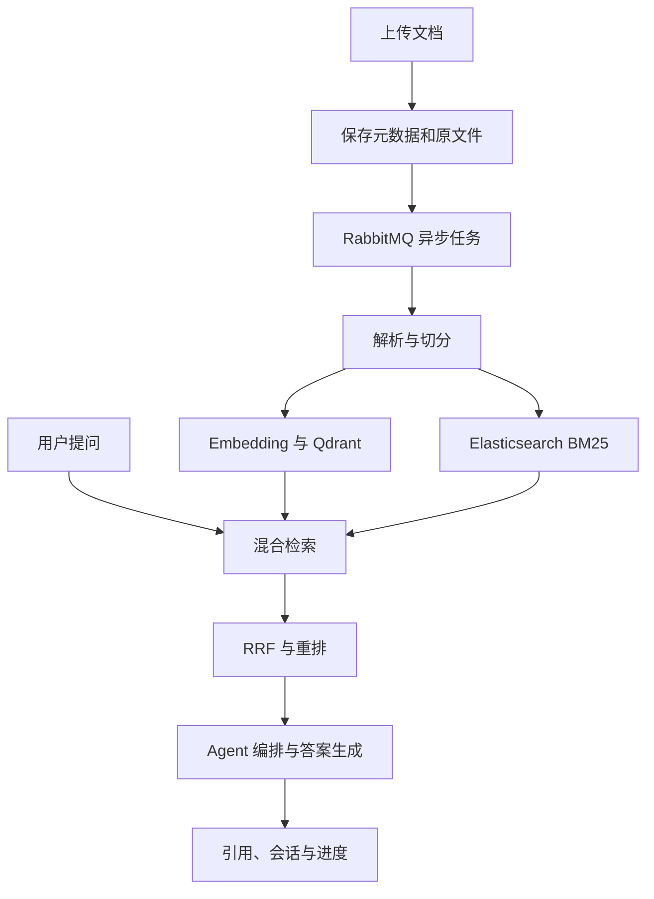
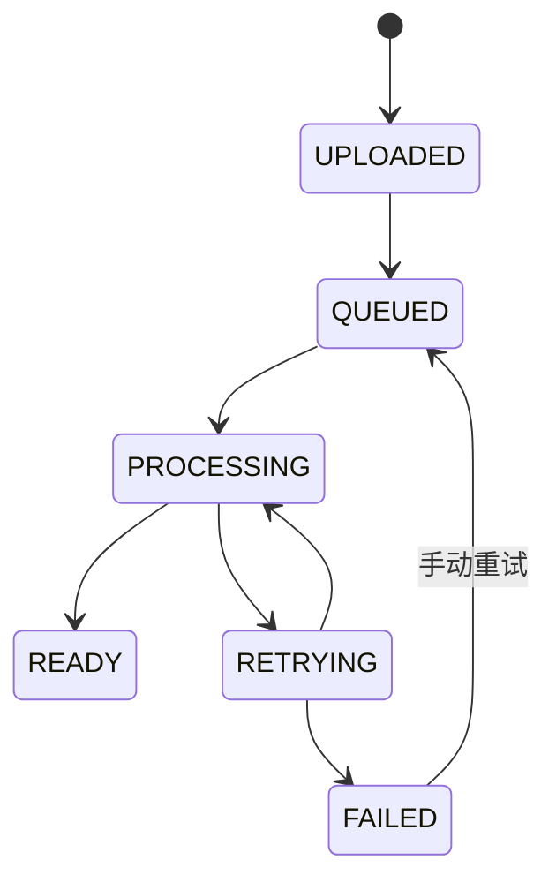
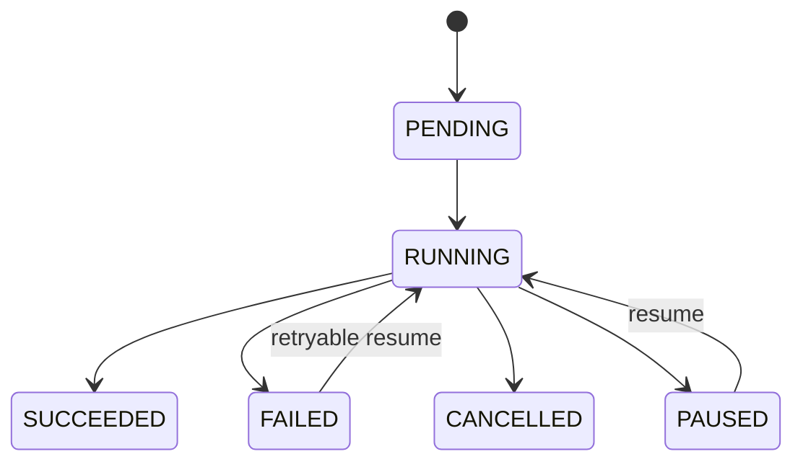

# 多范式 AI Agent 文档智能处理平台

## Agent 逐模块开发执行手册

> 适用项目：`ai-document-agent`  
> 本地目录：`D:\Project\ai-document-agent`  
> 基础包名：`com.wxx.aidocumentagent`  
> 技术基线：Java 21、Spring Boot 4.1.1、Spring AI 2.0.1、Maven、MySQL 8.4、Redis 8、RabbitMQ、Qdrant、Elasticsearch

---

## 0. 这份手册怎么使用

这不是一份只供阅读的架构说明，而是一份可以交给编码 Agent 逐项执行的施工手册。

推荐工作方式：

1. 一次只让 Agent 开发一个模块。
2. 每次先复制“总控提示词”，再复制对应模块的“模块提示词”。
3. Agent 完成后，必须检查代码差异、执行测试并填写进度记录。
4. 当前模块未通过验收，不进入下一个模块。
5. 每个模块单独提交 Git，便于定位错误和回滚。

推荐顺序：

`M00 → M01 → M02 → M03 → M04 → M05 → M06 → M07 → M08 → M09 → M10 → M11 → M12 → M13 → M14 → M15 → M16 → M17 → M18 → M19 → M20`

每次开始前，先确保基础设施状态正常：

```powershell
docker compose ps
.\mvnw.cmd -version
.\mvnw.cmd -DskipTests compile
Invoke-RestMethod http://localhost:8080/actuator/health | ConvertTo-Json -Depth 10
```

---

---

## 1. 项目当前基线

在开始模块开发前，Agent 必须先检查仓库，以实际代码为准。当前已知状态如下：

| 项目 | 当前状态 |
|---|---|
| Java | Oracle JDK 21.0.12 |
| Maven | Maven Wrapper 3.9.16 |
| Spring Boot | 4.1.1 |
| Spring AI | 2.0.1 |
| MySQL | Docker `mysql:8.4`，宿主机端口 `3307`，健康 |
| Redis | Docker `redis:8-alpine`，宿主机端口 `6380`，健康 |
| Flyway | 已执行 `V1__create_knowledge_base.sql` |
| 已有表 | `flyway_schema_history`、`knowledge_base` |
| 应用 | 可在 `8080` 启动 |
| 数据库健康检查 | `/actuator/health/db` 返回 `UP` |
| Redis 健康检查 | `/actuator/health/redis` 返回 `UP` |
| Qdrant | 尚未接入，启动告警属于当前阶段的预期现象 |

Agent 不得仅根据此表假设代码已经存在；必须先读取 `pom.xml`、`application.yml`、迁移脚本和 Java 源码。

---

## 2. 产品目标和最终能力

项目最终应成为一个可运行、可测试、可观测的文档智能问答平台，至少具备以下能力：

- 创建和管理知识库。
- 上传 PDF、DOCX、TXT 文档。
- 异步解析、切分、向量化和建立全文索引。
- 同时执行向量检索与 BM25 检索。
- 通过 RRF 融合和可选的 Cross-Encoder 重排提高召回质量。
- 基于检索证据生成带引用的答案。
- 保存会话与消息，并使用 Redis 保存短期上下文。
- 支持 Retrieval-First、ReAct、Plan-Execute-Reflect 三种 Agent 工作模式。
- 支持任务检查点、失败恢复、幂等和 WebSocket 进度推送。
- 提供评测、监控、部署说明和完整复现步骤。

### 2.1 总体数据流



### 2.2 推荐代码目录

```text
src/main/java/com/wxx/aidocumentagent/
├── AiDocumentAgentApplication.java
├── common/
│   ├── api/
│   ├── exception/
│   ├── model/
│   └── util/
├── config/
├── knowledgebase/
├── document/
│   ├── api/
│   ├── application/
│   ├── domain/
│   ├── infrastructure/
│   └── parser/
├── chunking/
├── ingestion/
├── embedding/
├── retrieval/
│   ├── vector/
│   ├── keyword/
│   ├── fusion/
│   └── rerank/
├── rag/
├── conversation/
├── agent/
│   ├── core/
│   ├── retrieval/
│   ├── react/
│   ├── plan/
│   └── tool/
├── checkpoint/
├── websocket/
└── observability/

src/main/resources/
├── application.yml
├── db/migration/
├── prompts/
└── static/
```

目录不要求机械照搬，但必须保持业务边界清晰。不要把所有类堆在 `controller`、`service`、`entity` 三个全局目录中。

---

## 3. Agent 总控提示词

每次开发模块时，先把下面内容发给 Agent，再附上对应模块提示词。

```text
你正在开发一个 Java 21 + Spring Boot 4.1.1 + Spring AI 2.0.1 的 Maven 项目。
项目路径是 D:\Project\ai-document-agent，基础包名是 com.wxx.aidocumentagent。

工作规则：
1. 先检查实际仓库：pom.xml、application.yml、compose.yaml、Flyway 脚本、现有源码、测试和 git diff。
2. 以仓库当前状态为准，不假设手册中的文件已经存在。
3. 本次只完成我指定的模块，不提前开发后续模块，不做无关重构。
4. 保留用户已有改动；发现工作区有无关修改时不要覆盖、删除或回滚。
5. 先给出简短实施计划，然后直接编码；除非遇到会改变产品行为的关键歧义，否则不要反复提问。
6. 数据库结构只能新增 Flyway 版本迁移，禁止修改已经执行的迁移脚本。
7. 密钥、口令不能写进源码或提交到 Git；通过环境变量注入。
8. Controller 只做协议适配、参数校验和调用应用服务，业务规则放在应用层或领域层。
9. 所有跨知识库的数据访问都必须显式校验 knowledgeBaseId，禁止数据串库。
10. 对外部服务设置连接与读取超时；重试只用于可重试错误，并限制次数。
11. 消息消费必须具备业务幂等；不能依赖 RabbitMQ 恰好只投递一次。
12. 不保存或返回模型隐藏思维链，只保存结构化计划、工具调用摘要、结果和错误。
13. 不伪造测试结果、性能数据或外部服务调用结果。缺少依赖时说明真实限制，并尽可能使用单元测试验证。
14. 优先复用 Spring Boot/Spring AI 官方抽象，避免重复造框架。
15. 完成后运行与本模块相关的测试，至少运行 .\mvnw.cmd -DskipTests compile；可运行集成测试时再运行 .\mvnw.cmd test。

每次结束必须报告：
- 完成内容
- 新增/修改文件
- 新增数据库迁移
- 执行的命令及真实结果
- 关键设计决策
- 尚存风险或未完成项
- 下一模块开始前需要确认的事项
```

### 3.1 Agent 变更边界

禁止行为：

- 未经要求把单体项目拆为微服务。
- 为了“整洁”大面积移动已有文件。
- 删除暂时未使用但属于后续模块的依赖。
- 把 API Key、数据库密码写进 `application.yml`。
- 在异常响应中返回堆栈、SQL、内部路径或密钥。
- 将模型生成文本直接当作可信 SQL、类名或文件路径执行。
- 把“程序可以编译”等同于“模块验收通过”。

---

## 4. 全局技术约定

### 4.1 本地端口

| 服务 | 容器端口 | 宿主机端口 |
|---|---:|---:|
| 应用 | 8080 | 8080 |
| MySQL | 3306 | 3307 |
| Redis | 6379 | 6380 |
| RabbitMQ | 5672 / 15672 | 5672 / 15672 |
| Qdrant | 6333 / 6334 | 6333 / 6334 |
| Elasticsearch | 9200 | 9200 |

如果宿主机端口冲突，可以修改 `compose.yaml`，但必须同步修改 `.env.example` 和开发文档。

### 4.2 配置规则

```yaml
spring:
  datasource:
    url: ${DB_URL:jdbc:mysql://localhost:3307/ai_document_agent}
    username: ${DB_USERNAME:ai_agent}
    password: ${DB_PASSWORD:}
  data:
    redis:
      host: ${REDIS_HOST:localhost}
      port: ${REDIS_PORT:6380}
  ai:
    openai:
      api-key: ${OPENAI_API_KEY:}
```

- 仓库只保留 `.env.example`，真实 `.env` 必须加入 `.gitignore`。
- 新增配置必须有清晰前缀和默认值策略。
- 对模型名、批量大小、分块参数、Top-K、超时等使用配置属性类。
- 生产环境禁止依赖开发环境默认密码。

### 4.3 API 约定

统一返回结构建议：

```json
{
  "code": "OK",
  "message": "success",
  "data": {},
  "traceId": "01J...",
  "timestamp": "2026-09-20T17:30:00+08:00"
}
```

错误码前缀：

| 前缀 | 含义 |
|---|---|
| `COMMON_` | 通用参数或系统错误 |
| `KB_` | 知识库错误 |
| `DOC_` | 文档错误 |
| `INGEST_` | 摄取流水线错误 |
| `RETRIEVAL_` | 检索错误 |
| `AGENT_` | Agent 编排错误 |
| `MODEL_` | 模型调用错误 |

分页请求统一使用 `page`、`size`、`sort`，页码从 0 开始。时间统一以 ISO-8601 对外输出，数据库使用毫秒精度。

### 4.4 数据库约定

- 表名和字段名使用 `snake_case`。
- 主键使用 `BIGINT` 或 UUID，但同一领域保持一致。
- 每张业务表至少包含 `created_at`、`updated_at`。
- 状态字段使用字符串枚举，长度足够且有校验。
- 唯一约束必须反映业务幂等要求。
- 所有外键关联字段建立索引；是否使用数据库外键由模块设计决定，但应用层必须校验关联存在性。
- 已执行的 `V1__create_knowledge_base.sql` 永远不修改；后续从 `V2__...sql` 开始。

### 4.5 测试分层

| 测试类型 | 目标 | 推荐工具 |
|---|---|---|
| 单元测试 | 纯业务规则、算法、状态机 | JUnit 5、Mockito |
| 切片测试 | MVC、JPA、序列化 | Spring Boot Test slices |
| 集成测试 | MySQL、Redis、RabbitMQ、Qdrant、ES | Testcontainers 或本地 Compose |
| 契约测试 | API 请求响应和错误码 | MockMvc / REST Assured |
| 端到端测试 | 上传到问答的完整链路 | 脚本 + Compose |

每个模块的测试至少包含正常路径、参数边界、资源不存在和重复操作。

---

## 5. 模块依赖与交付顺序

| 模块 | 名称 | 依赖 | 核心交付物 |
|---|---|---|---|
| M00 | 基线审计 | 无 | 仓库报告、配置修正、测试基线 |
| M01 | 通用内核 | M00 | 统一响应、异常、traceId |
| M02 | 知识库 | M01 | KnowledgeBase CRUD |
| M03 | 文档接入 | M02 | 元数据、上传、存储抽象 |
| M04 | 文档解析 | M03 | PDF/DOCX/TXT 解析器 |
| M05 | 文本切分 | M04 | 可插拔分块、chunk 数据模型 |
| M06 | 异步摄取 | M05 | RabbitMQ、重试、DLQ、幂等 |
| M07 | 向量索引 | M06 | Embedding、Qdrant |
| M08 | 关键词索引 | M06 | Elasticsearch BM25 |
| M09 | 混合检索 | M07、M08 | RRF 融合 |
| M10 | 重排 | M09 | Cross-Encoder 接口与实现 |
| M11 | RAG 问答 | M10 | 带引用回答 |
| M12 | 会话记忆 | M11 | 会话、消息、Redis 短记忆 |
| M13 | Agent 内核 | M12 | 接口、上下文、路由 |
| M14 | Retrieval-First | M13 | 检索优先 Agent |
| M15 | ReAct | M13 | 工具注册和循环 |
| M16 | Plan-Execute-Reflect | M13 | 计划、执行、反思 |
| M17 | 检查点恢复 | M15、M16 | 状态持久化、恢复 |
| M18 | 实时进度 | M17 | WebSocket 事件 |
| M19 | 评测与可观测性 | M14-M18 | 指标、评测、压测 |
| M20 | 交付与复现 | 全部 | Compose、README、演示脚本 |

---

# 第一阶段：工程与核心业务

## M00：工程基线审计

### 目标

确认当前仓库能被稳定复现，消除后续开发中的版本、配置和构建歧义。

### 任务

- 检查 Java、Maven Wrapper、Spring Boot、Spring AI 版本。
- 检查 `pom.xml` 是否存在重复或无效依赖。
- 检查 `.env` 是否被忽略，并补充 `.env.example`。
- 检查 `compose.yaml`、`application.yml` 和端口是否一致。
- 检查 Flyway 是否启用，以及 V1 是否已经执行。
- 新增 `docs/development-progress.md`。
- 新增最小上下文启动测试；若外部依赖会阻塞测试，使用测试 profile 隔离。
- 记录当前未启动组件，例如 RabbitMQ、Qdrant、Elasticsearch。

### 验收标准

- `.\mvnw.cmd -DskipTests compile` 成功。
- 应用启动后 DB 和 Redis 健康检查为 `UP`。
- Git 不追踪真实 `.env`。
- `README` 或进度文档能说明从零启动当前基线的方法。
- Agent 没有为了消除 Qdrant 告警而错误删除后续所需依赖。

### 模块提示词

```text
执行 M00 工程基线审计。
请先读取整个项目结构、pom.xml、application.yml、compose.yaml、.gitignore、Flyway 脚本和现有测试。
只修复会影响构建、配置安全、启动或后续开发的基线问题。
创建 docs/development-progress.md，记录已完成能力、验证命令、已知问题和下一模块。
不要开始知识库 CRUD，不要添加 RabbitMQ/Qdrant/Elasticsearch 业务代码。
完成后按总控提示词规定的格式汇报，并给出可以由我在 Windows PowerShell 复制执行的验证命令。
```

---

## M01：通用响应、异常与请求追踪

### 目标

建立所有后续 REST API 共用的协议和错误处理基础。

### 交付物

- `ApiResponse<T>`。
- `ErrorCode` 接口或枚举体系。
- `BusinessException`。
- `GlobalExceptionHandler`。
- Bean Validation 错误映射。
- traceId 过滤器及 MDC 集成。
- 响应和异常测试。

### 关键要求

- 业务异常与系统异常分开处理。
- 参数错误返回 400；资源不存在返回 404；冲突返回 409；未知错误返回 500。
- 生产响应不能包含堆栈、数据库语句、文件绝对路径。
- 请求进入时复用合法的 `X-Trace-Id`，否则生成新值；响应头带回 traceId。
- 日志格式可以关联 traceId。

### 验收标准

- 构造一个测试接口时，成功和失败响应结构一致。
- `@Valid` 校验失败能精确指出字段。
- 未捕获异常被转换为安全的通用错误。
- 并发请求之间 traceId 不串联，响应结束后 MDC 被清理。

### 模块提示词

```text
执行 M01 通用内核模块。
实现统一 ApiResponse、错误码、业务异常、全局异常处理、参数校验错误映射和 traceId/MDC 过滤器。
先检查 Spring Boot 4.1.1 当前使用的 WebMVC API，不要照搬旧版 javax 包名；统一使用 jakarta。
为成功响应、业务异常、资源不存在、参数错误、未知异常、traceId 生成与透传编写测试。
不要开发任何具体业务 CRUD。
完成后运行编译和本模块测试，并列出对后续模块必须遵守的 API 规范。
```

---

## M02：知识库管理

### 目标

完成知识库的创建、查询、修改和删除，为所有文档与检索数据提供租户边界。

### API

| 方法 | 路径 | 说明 |
|---|---|---|
| `POST` | `/api/v1/knowledge-bases` | 创建知识库 |
| `GET` | `/api/v1/knowledge-bases/{id}` | 查询详情 |
| `GET` | `/api/v1/knowledge-bases` | 分页列表 |
| `PUT` | `/api/v1/knowledge-bases/{id}` | 更新名称和描述 |
| `DELETE` | `/api/v1/knowledge-bases/{id}` | 删除空知识库 |

### 数据规则

- 名称必填，去除首尾空格后长度 1–128。
- 名称全局唯一；以后若引入用户体系，再调整为用户内唯一。
- 描述最大 512 字符。
- 删除前检查知识库是否存在。
- 当前阶段仅允许删除没有文档的知识库；后续接入文档后补充关联校验。
- Entity 不直接作为 API 请求或响应对象。

### 验收标准

- CRUD 正常工作，分页参数有上限。
- 同名创建返回 409 和稳定错误码。
- 查询不存在资源返回 404。
- Repository、Service、Controller 各自职责清晰。
- 有 Service 单元测试和 Controller 契约测试。

### 模块提示词

```text
执行 M02 知识库管理模块。
先检查 V1__create_knowledge_base.sql 以及是否已有 KnowledgeBase 代码；不得修改已经执行的 V1。
基于现有表实现 Entity、Repository、应用服务、DTO、请求参数和 REST Controller。
实现创建、详情、分页、更新、删除，处理名称唯一冲突和不存在错误。
Entity 不得直接暴露给 API。分页 size 设置合理上限。
编写 Service 单元测试与 MockMvc 契约测试。
不要开发文档上传或检索功能。
```

---

## M03：文档元数据与安全上传

### 目标

允许用户向指定知识库上传文档，安全保存原始文件并记录生命周期状态。

### 数据表

新增 `V2__create_document.sql`，建议字段：

| 字段 | 说明 |
|---|---|
| `id` | 文档主键 |
| `knowledge_base_id` | 所属知识库 |
| `original_name` | 用户原始文件名 |
| `storage_key` | 服务端生成的存储键 |
| `content_type` | MIME 类型 |
| `extension` | 标准化扩展名 |
| `size_bytes` | 文件大小 |
| `sha256` | 内容摘要 |
| `status` | `UPLOADED/PROCESSING/READY/FAILED/DELETED` |
| `error_code` | 处理失败错误码 |
| `error_message` | 截断后的安全错误摘要 |
| `created_at/updated_at` | 时间戳 |

建议唯一约束：`(knowledge_base_id, sha256)`，用于避免同一知识库重复上传相同文件。

### 存储抽象

定义 `DocumentStorage`：

```java
public interface DocumentStorage {
    StoredObject store(InputStream input, String extension, long size);
    InputStream load(String storageKey);
    void delete(String storageKey);
}
```

第一版实现本地文件存储，但路径必须来自配置。保存名使用服务端生成的 UUID，不能使用原始文件名拼路径。

### API

| 方法 | 路径 | 说明 |
|---|---|---|
| `POST` | `/api/v1/knowledge-bases/{kbId}/documents` | multipart 上传 |
| `GET` | `/api/v1/knowledge-bases/{kbId}/documents` | 分页列表 |
| `GET` | `/api/v1/knowledge-bases/{kbId}/documents/{id}` | 文档详情 |
| `DELETE` | `/api/v1/knowledge-bases/{kbId}/documents/{id}` | 逻辑删除或受控删除 |

### 安全要求

- 白名单仅允许 `.pdf`、`.docx`、`.txt`。
- 同时校验扩展名、MIME 和文件签名，不只相信客户端 Content-Type。
- 配置单文件最大值。
- 防止 `../` 路径穿越和绝对路径注入。
- 空文件、超限文件、损坏文件返回明确错误码。
- 上传接口此阶段只完成保存和记录，不同步做耗时解析。

### 验收标准

- 合法文件成功保存，数据库记录状态为 `UPLOADED`。
- 非法扩展名、空文件、超限文件被拒绝。
- 相同知识库上传相同内容返回幂等结果或 409，行为必须写入文档。
- 不同知识库不能访问彼此文档。
- 删除数据库记录与物理文件时有一致性策略。

### 模块提示词

```text
执行 M03 文档元数据与安全上传模块。
新增 V2 Flyway 迁移创建 document 表；如果 V2 已存在，则使用下一个可用版本，绝不能修改已执行脚本。
实现 DocumentStorage 抽象和本地磁盘实现，存储根目录使用配置，文件名由服务端生成。
实现 PDF、DOCX、TXT 白名单上传、大小限制、空文件检查、基础文件签名/MIME 校验、SHA-256 去重、列表、详情和删除。
所有查询必须同时带 knowledgeBaseId 与 documentId，避免跨知识库访问。
上传请求不得同步解析正文。
编写路径穿越、非法类型、重复内容、资源不存在、跨知识库访问测试。
```

---

## M04：文档解析

### 目标

将不同格式的原文件转换为统一的结构化文本表示。

### 核心接口

```java
public interface DocumentParser {
    boolean supports(DocumentType type);
    ParsedDocument parse(DocumentSource source);
}
```

`ParsedDocument` 至少包含：

- 完整文本。
- 页面或段落列表。
- 标题、作者等可获得的元数据。
- 页码映射。
- 解析告警，例如空页、乱码、截断。

### 实现范围

- `TxtDocumentParser`：检测 BOM 和常见 UTF 编码，拒绝二进制内容。
- `PdfDocumentParser`：保留页码，处理加密、空白和损坏 PDF。
- `DocxDocumentParser`：提取段落、标题和表格中的文本。
- `DocumentParserRegistry`：根据标准化类型选择解析器。

可根据依赖兼容性使用 Apache Tika、PDFBox、Apache POI；选择后应锁定版本并写测试。

### 验收标准

- 三种格式均有小型测试夹具。
- 输出统一，换行和空白经过规范化但不破坏段落边界。
- PDF 的文本片段可以追溯到页码。
- 加密或损坏文件产生可识别业务错误，而不是无意义的 500。
- 不将整个超大文档复制多份导致明显内存浪费。

### 模块提示词

```text
执行 M04 文档解析模块。
设计 DocumentParser、ParsedDocument、ParsedSection 和解析器注册表，实现 TXT、PDF、DOCX 三种解析器。
选择与 Java 21/Spring Boot 4 兼容的稳定解析库，仅添加实际需要的依赖。
保留 PDF 页码、DOCX 段落/表格信息，统一规范化空白和换行。
对加密 PDF、损坏文件、空文本、编码异常给出稳定错误码。
用 src/test/resources 下的小型夹具编写解析测试，不要接入 RabbitMQ、Embedding 或检索。
```

---

## M05：可插拔文本切分

### 目标

把解析结果切成可索引、可引用、可复现的文本块，并支持多种切分策略。

### 数据表

新增迁移创建 `document_chunk`：

| 字段 | 说明 |
|---|---|
| `id` | chunk 主键 |
| `knowledge_base_id` | 冗余租户边界，便于安全查询 |
| `document_id` | 文档 ID |
| `chunk_index` | 文档内顺序，从 0 开始 |
| `content` | 文本内容 |
| `content_hash` | 文本摘要 |
| `token_count` | 估算或实际 token 数 |
| `page_from/page_to` | 页码范围，可空 |
| `section_title` | 章节标题，可空 |
| `metadata_json` | 扩展元数据 |
| `created_at/updated_at` | 时间戳 |

唯一约束至少覆盖 `(document_id, chunk_index)`。

### 策略接口

```java
public interface ChunkingStrategy {
    String name();
    List<TextChunk> split(ParsedDocument document, ChunkingOptions options);
}
```

第一版实现：

- `FixedWindowChunkingStrategy`：按字符或 token 窗口，带 overlap。
- `ParagraphChunkingStrategy`：优先保留段落边界，超长段落再降级切分。

推荐默认值先配置化，不硬编码：例如目标 700–1000 tokens、overlap 100–150 tokens。最终值应通过 M19 评测决定。

### 关键不变量

- 空 chunk 不入库。
- chunk 顺序稳定；同一输入和配置重复执行产生相同索引与内容摘要。
- overlap 必须小于 chunk size。
- 每个 chunk 可以追溯到文档、页码和章节。
- 重新切分前要有替换策略，避免旧、新 chunk 混合。

### 验收标准

- 固定窗口和段落策略都有边界测试。
- 超长段落、短文档、多空行、中文无空格文本均能处理。
- 重复执行结果确定。
- 数据库批量写入，避免逐条无边界提交。

### 模块提示词

```text
执行 M05 可插拔文本切分模块。
新增 document_chunk 表的下一版本 Flyway 迁移，建立知识库、文档和顺序相关索引/唯一约束。
设计 ChunkingStrategy 和配置对象，实现固定窗口与段落优先两种策略。
保留 documentId、knowledgeBaseId、chunkIndex、页码、章节、tokenCount、contentHash 等元数据。
保证同一输入和配置下结果稳定，校验 overlap < chunk size，过滤空块。
实现批量保存和安全的重新切分替换方法。
编写中文、英文、短文本、超长段落、多页、非法参数和重复执行测试。
不要调用 Embedding 或消息队列。
```

---

# 第二阶段：异步摄取与检索

## M06：RabbitMQ 异步摄取流水线

### 目标

把“解析、切分、建立索引”从上传请求中解耦，形成可重试、可观测、幂等的异步流水线。

### 基础设施

在 `compose.yaml` 中加入 RabbitMQ 管理版镜像，并配置健康检查、持久化卷和环境变量。建议资源：

| 类型 | 名称示例 |
|---|---|
| Exchange | `document.ingestion.exchange` |
| 主队列 | `document.ingestion.queue` |
| Routing key | `document.ingestion.requested` |
| 重试队列 | `document.ingestion.retry.queue` |
| 死信队列 | `document.ingestion.dlq` |

名称应通过配置集中管理，不要散落硬编码。

### 消息契约

消息只传标识和控制信息，不传整个文件：

```json
{
  "eventId": "UUID",
  "documentId": 101,
  "knowledgeBaseId": 9,
  "operation": "INGEST",
  "attempt": 0,
  "occurredAt": "2026-09-20T17:30:00Z",
  "schemaVersion": 1
}
```

### 状态机



### 可靠性要求

- 发布消息使用 publisher confirm；发布失败不能把文档误标为已排队。
- 消费者使用合适的确认策略，成功完成后再确认。
- 业务幂等键使用 `documentId + operation + version` 或等价方案。
- 可重试错误采用有限次数指数退避；永久错误直接进入失败态或 DLQ。
- 错误消息不能无限循环。
- 同一文档重复投递不能产生重复 chunk 或重复索引。
- 数据库与消息一致性优先使用 outbox；如本阶段暂不实现，必须明确记录窗口风险并提供补偿扫描。

### 验收标准

- 上传后快速返回，后台完成解析和切分。
- 重复发送同一消息，最终只有一套有效 chunk。
- 模拟一次瞬时失败后可以重试成功。
- 永久失败进入 `FAILED`，包含安全错误摘要，并可手动重试。
- RabbitMQ 重启后持久消息仍可处理。

### 模块提示词

```text
执行 M06 RabbitMQ 异步摄取模块。
检查现有 compose 和配置，加入 RabbitMQ 管理版服务、健康检查和持久卷。
定义版本化摄取消息契约、exchange、主队列、有限重试队列和 DLQ。
把上传后的处理改为异步：发布任务，消费者加载原文件，调用已有解析和切分服务，批量替换 chunk，并维护文档状态机。
实现 publisher confirm、消费者幂等、可重试/不可重试错误分类、有限重试、失败摘要和手动重试入口。
如果没有实现事务 outbox，必须实现定时补偿扫描并在文档中说明一致性窗口。
测试重复投递、瞬时失败、永久失败、非法状态转换和成功处理。
不要在本模块做 Embedding、Qdrant 或 Elasticsearch。
```

---

## M07：Embedding 与 Qdrant 向量索引

### 目标

为每个 chunk 生成向量并写入 Qdrant，实现限定知识库的语义检索。

### 基础设施和配置

- 在 Compose 中增加 Qdrant，并持久化数据目录。
- 配置 host、HTTP/gRPC 端口、collection 名称、API key（远端场景）和初始化策略。
- Embedding 模型名、维度、批量大小、超时必须配置化。
- 启动时检查 collection 向量维度和距离类型；不匹配时必须明确失败，不能静默混用。

### 向量负载

每个 point 至少保存：

```json
{
  "chunkId": 1001,
  "documentId": 101,
  "knowledgeBaseId": 9,
  "chunkIndex": 3,
  "pageFrom": 5,
  "pageTo": 6,
  "contentHash": "...",
  "embeddingModel": "..."
}
```

point ID 必须稳定，建议由 chunk ID 确定，以便重复 upsert 幂等。

### 核心接口

```java
public interface VectorIndex {
    void upsert(List<ChunkVector> vectors);
    List<VectorHit> search(VectorQuery query);
    void deleteByDocument(long knowledgeBaseId, long documentId);
}
```

业务代码依赖自定义接口，Spring AI Qdrant VectorStore 作为基础设施实现，避免向领域层泄露供应商类型。

### 验收标准

- 批量生成 embedding，避免单 chunk 单请求。
- 所有搜索强制带 `knowledgeBaseId` 过滤器。
- 重复索引不产生重复 point。
- 删除或重新处理文档时，旧向量可清除或覆盖。
- 模型超时、限流、鉴权失败、维度不符有明确分类。
- 没有真实模型密钥时，使用确定性 fake embedding 完成自动化测试，不伪装为真实效果。

### 模块提示词

```text
执行 M07 Embedding 与 Qdrant 向量索引模块。
在 compose 中加入 Qdrant 和健康检查。使用 Spring AI 2.0.1 的 Qdrant VectorStore，但在业务层定义自己的 VectorIndex 接口。
配置 embedding 模型、维度、批量大小、超时和 collection；启动时校验 collection 维度。
以稳定 pointId 批量 upsert chunk 向量，payload 包含 knowledgeBaseId、documentId、chunkId、页码和模型版本。
语义检索必须强制按 knowledgeBaseId 过滤。实现按文档删除/替换向量。
将向量索引接入 M06 流水线，并保证重复消费幂等。
使用确定性 fake embedding 编写单元/集成测试；若环境有真实 API Key，再提供可选 smoke test。
```

---

## M08：Elasticsearch BM25 全文索引

### 目标

建立关键词检索通道，补足向量检索在专有名词、编号、错误码和精确短语上的不足。

### 索引设计

索引名可以采用固定别名，例如 `document_chunks_v1` + `document_chunks` alias。字段建议：

| 字段 | 类型 | 用途 |
|---|---|---|
| `chunkId` | keyword/long | 稳定标识 |
| `knowledgeBaseId` | keyword/long | 必选过滤 |
| `documentId` | keyword/long | 过滤与删除 |
| `content` | text | BM25 搜索 |
| `title` | text | 可提高权重 |
| `sectionTitle` | text | 可提高权重 |
| `pageFrom/pageTo` | integer | 引用 |
| `contentHash` | keyword | 版本校验 |

中文分析器必须明确选择。若使用 IK 等插件，Compose 镜像必须可复现；若不依赖插件，可先使用官方分析器和合适的 n-gram/standard 组合，并记录局限。

### 核心接口

```java
public interface KeywordIndex {
    void upsert(List<KeywordDocument> chunks);
    List<KeywordHit> search(KeywordQuery query);
    void deleteByDocument(long knowledgeBaseId, long documentId);
}
```

### 验收标准

- 索引 mapping 由代码或版本化资源明确创建，不依赖手工点击。
- `knowledgeBaseId` 始终作为 filter，而不是可选查询词。
- 批量索引并检查 bulk item 级错误。
- 重复写入以 chunk ID 覆盖。
- 精确编号和中文关键词测试能返回预期结果。
- 文档重处理和删除会清理旧索引。

### 模块提示词

```text
执行 M08 Elasticsearch BM25 模块。
在 compose 中加入与当前 Spring Data Elasticsearch 兼容的 Elasticsearch 服务、健康检查和持久卷。
设计可版本化 mapping 和 alias，明确中文分词策略及其可复现方式。
实现 KeywordIndex 接口、批量 upsert、按知识库过滤搜索、按文档删除。
文档 ID 使用稳定 chunkId，逐项检查 bulk 写入结果。
把关键词索引步骤接入 M06，定义向量成功但 ES 失败时的状态与重试策略。
编写专有名词、编号、中文关键词、跨知识库隔离、重复索引与删除测试。
```

---

## M09：混合检索与 RRF 融合

### 目标

并行执行向量检索和关键词检索，用 Reciprocal Rank Fusion 合并结果。

### 输入输出

```java
public record RetrievalQuery(
    long knowledgeBaseId,
    String query,
    int vectorTopK,
    int keywordTopK,
    int finalTopK
) {}
```

输出 `RetrievedChunk` 至少包含 chunk 内容、来源文档、页码、两路排名/分数、融合分数和命中通道。

### RRF 规则

对文档 $d$：

$$
RRF(d) = \sum_{r \in R} \frac{w_r}{k + rank_r(d)}
$$

- `R` 是向量和关键词结果集合。
- `k` 默认可设为 60，但必须配置化。
- `w_r` 是可选通道权重，默认 1。
- 用 `chunkId` 去重。
- 同分结果使用稳定次级排序，保证测试可重复。

### 可靠性策略

- 两路都成功：融合。
- 一路超时或失败：可降级到另一路，并在结果元数据记录 degraded。
- 两路都失败：返回检索错误，不调用模型编造答案。
- 设置总超时预算，不能两个请求无界等待。

### 验收标准

- RRF 使用排名而不是直接混合不可比的原始分数。
- 向量和关键词重复命中的 chunk 只返回一次。
- 单路故障降级行为有测试。
- knowledgeBaseId 贯穿两路查询。
- 返回结果顺序确定且截断到 finalTopK。

### 模块提示词

```text
执行 M09 混合检索与 RRF 融合模块。
定义统一 RetrievalQuery、RetrievedChunk 和 HybridRetriever。
并行调用 VectorIndex 与 KeywordIndex，设置单路和总超时；使用 chunkId 去重。
按 RRF 公式融合排名，k、通道权重、各路 topK、最终 topK 配置化；同分必须稳定排序。
允许单路失败时降级并返回 degraded 元数据，两路都失败时抛出明确业务错误。
为 RRF 数学结果、重复命中、空结果、单路故障、双路故障、超时和跨知识库隔离编写测试。
不要在本模块调用 ChatModel。
```

---

## M10：Cross-Encoder 重排

### 目标

对混合检索候选进行更精确的 query-document 相关性排序，同时支持关闭和故障降级。

### 接口

```java
public interface Reranker {
    List<RankedChunk> rerank(String query, List<RetrievedChunk> candidates, int topN);
}
```

实现至少两个 Bean：

- `NoOpReranker`：保持输入顺序，便于本地无模型环境运行。
- 一个 HTTP Cross-Encoder 客户端或实际选定供应商实现。

### 要求

- 候选数量设上限，避免成本和延迟失控。
- 批量发送候选，不逐条调用。
- 对输入内容长度做截断，但保留引用原文不被改写。
- 设置超时、认证、错误映射和熔断/降级策略。
- 记录重排前排名、重排后排名、分数与耗时。

### 验收标准

- 开关关闭时不发送外部请求。
- 服务不可用时按配置降级到 RRF 顺序。
- topN、最大候选数、最大文本长度生效。
- 相同分数稳定排序。
- 使用 fake reranker 验证排序映射无错位。

### 模块提示词

```text
执行 M10 Cross-Encoder 重排模块。
设计 Reranker 接口、NoOp 实现和可配置 HTTP Cross-Encoder 实现。
限制候选数和单条文本长度，批量调用，配置连接/读取超时、API Key、启用开关和失败降级。
保留 RRF 原排名，并输出 rerankScore 与新排名；相同分数稳定排序。
不要把候选内容与返回分数按数组位置盲目绑定，必须校验 ID 映射。
用 fake HTTP 服务或 mock 编写正常排序、部分无效响应、超时、服务失败、关闭开关和降级测试。
```

---

## M11：RAG 问答与可验证引用

### 目标

基于检索证据回答问题，并返回机器可校验的来源引用。

### API

`POST /api/v1/knowledge-bases/{kbId}/query`

请求示例：

```json
{
  "question": "系统如何处理重复消息？",
  "topK": 8,
  "rerank": true,
  "stream": false
}
```

响应核心数据：

```json
{
  "answer": "...",
  "citations": [
    {
      "citationId": "C1",
      "documentId": 101,
      "documentName": "design.pdf",
      "chunkId": 1001,
      "pageFrom": 5,
      "pageTo": 5,
      "quote": "..."
    }
  ],
  "retrieval": {
    "degraded": false,
    "candidateCount": 8
  }
}
```

### 提示词原则

- 明确要求只根据上下文回答。
- 证据不足时明确说不知道，并建议补充资料。
- 上下文片段使用稳定引用 ID，例如 `[C1]`。
- 把检索内容当作不可信数据，防止文档中的提示注入改变系统指令。
- 不让模型自行发明 documentId、chunkId 或页码；引用由程序根据选中 chunk 组装和校验。

### 上下文预算

- 根据模型上下文窗口设置总预算。
- 优先保留高排名且来源多样的片段。
- 对同一文档连续重叠 chunk 去冗余。
- 截断时不破坏引用映射。

### 验收标准

- 有证据时答案包含有效引用。
- 每个引用都对应本次检索结果中的真实 chunk。
- 无结果时不调用或不强迫模型编造答案。
- 文档中包含“忽略系统指令”等文本时不会改变系统行为。
- 模型调用记录 token、耗时、模型名和成功/失败，不记录密钥。

### 模块提示词

```text
执行 M11 RAG 问答模块。
实现知识库 query API，依次调用混合检索、可选重排、上下文构建和 Spring AI ChatClient。
提示词要求仅依据上下文回答、证据不足明确说明、使用 [C1] 形式引用，并把文档文本视为不可信数据。
引用元数据必须由程序从真实检索结果生成并校验，禁止信任模型虚构的 documentId、chunkId 或页码。
实现上下文 token/字符预算、重叠去冗余、超时和无检索结果短路。
提供 fake ChatModel 测试：有效引用、无证据、非法引用、提示注入文本、超时和检索降级。
```

---

# 第三阶段：会话与 Agent 编排

## M12：会话、消息与短期记忆

### 目标

保存可审计的会话记录，并使用 Redis 维护有界短期上下文。

### 数据表

新增 `conversation` 与 `conversation_message`：

| 表 | 关键字段 |
|---|---|
| `conversation` | `id`、`knowledge_base_id`、`title`、`agent_mode`、`created_at`、`updated_at` |
| `conversation_message` | `id`、`conversation_id`、`role`、`content`、`citations_json`、`model_name`、`token_usage_json`、`created_at` |

不要存储模型隐藏思维链。可存储用户输入、最终回答、引用、结构化工具调用摘要和错误状态。

### Redis 设计

- Key 示例：`chat:memory:{conversationId}`。
- 设置 TTL，例如 24 小时，可配置。
- 限制最近消息数和总 token 预算。
- Redis 丢失时可以从 MySQL 最近消息重建。
- 避免在缓存中永久保存敏感原文。

### API

| 方法 | 路径 | 说明 |
|---|---|---|
| `POST` | `/api/v1/knowledge-bases/{kbId}/conversations` | 创建会话 |
| `GET` | `/api/v1/knowledge-bases/{kbId}/conversations` | 会话列表 |
| `GET` | `/api/v1/conversations/{id}/messages` | 消息列表 |
| `POST` | `/api/v1/conversations/{id}/messages` | 发消息并获得回答 |
| `DELETE` | `/api/v1/conversations/{id}` | 删除会话 |

### 验收标准

- 会话固定关联一个知识库。
- 消息顺序稳定，分页无丢失/重复。
- Redis 命中时使用缓存，缓存缺失时可回源 MySQL。
- TTL 和最大上下文限制有效。
- 同一次请求失败时不会只保存助手半条消息。

### 模块提示词

```text
执行 M12 会话与短期记忆模块。
新增 conversation、conversation_message 的下一版本 Flyway 迁移，实现会话和消息 API。
MySQL 保存用户消息、最终助手回答、引用、模型元数据；禁止保存隐藏思维链。
Redis 保存有 TTL、最大消息数和 token 预算的短期上下文，缓存未命中时从 MySQL 重建。
确保 conversationId 与 knowledgeBaseId 关系始终校验，消息排序确定。
设计事务边界，避免模型失败后出现不一致的助手消息。
测试缓存命中/未命中、TTL、上下文裁剪、跨知识库访问、并发消息和失败回滚。
```

---

## M13：Agent 内核、上下文与路由

### 目标

在 RAG 能力之上建立统一 Agent 接口，使不同推理范式共享检索、工具、会话和可观测能力。

### 核心模型

```java
public interface DocumentAgent {
    AgentMode mode();
    AgentResult execute(AgentRequest request, AgentExecutionContext context);
}
```

建议类型：

- `AgentMode`：`RETRIEVAL_FIRST`、`REACT`、`PLAN_EXECUTE_REFLECT`。
- `AgentRequest`：问题、knowledgeBaseId、conversationId、参数。
- `AgentExecutionContext`：traceId、deadline、memory、事件发布器、取消信号。
- `AgentResult`：最终答案、引用、结构化步骤摘要、工具调用摘要、状态和用量。
- `AgentRouter`：根据显式 mode 或受控规则选择实现。

### 路由原则

- 初期由客户端显式选择 Agent mode，默认 `RETRIEVAL_FIRST`。
- 自动路由只能输出预定义枚举，不允许动态类名。
- 无效模式返回 400。
- Agent 共用统一的 deadline、取消、事件和错误模型。

### 验收标准

- 三种 Agent 可在不改变 API 主协议的情况下注册。
- Router 不包含具体 Agent 业务实现。
- 执行上下文不可被不同请求共享污染。
- AgentResult 不泄露隐藏思维链。
- 有路由、默认模式、无效模式和实现异常测试。

### 模块提示词

```text
执行 M13 Agent 内核模块。
定义 DocumentAgent、AgentMode、AgentRequest、AgentExecutionContext、AgentResult、结构化步骤/工具摘要和 AgentRouter。
默认选择 RETRIEVAL_FIRST，允许请求显式选择；所有模式来自白名单枚举。
统一 deadline、取消信号、事件发布、会话上下文、错误分类和用量统计接口。
AgentResult 只能包含最终答案、引用、结构化计划/步骤状态、工具调用摘要，禁止暴露模型隐藏思维链。
此模块只搭骨架和路由测试，不实现 ReAct 或 Plan-Execute-Reflect 业务循环。
```


---

---

## M14：Retrieval-First Agent

### 目标

实现最稳健的默认 Agent：先检索，再基于证据回答，不进行开放式工具循环。

### 执行步骤

1. 校验知识库、会话和问题。
2. 从短期记忆提取必要上下文并重写检索问题；问题重写失败时使用原问题。
3. 执行混合检索和可选重排。
4. 判断证据是否达到最低阈值。
5. 构建有引用的上下文并调用模型。
6. 校验引用、保存消息、发布完成事件。

### 边界

- 不允许任意工具调用。
- 无证据或低置信度时返回明确的证据不足结果。
- 只在当前知识库中检索。
- 多轮问题重写不能改变用户核心意图。
- 总执行时间受 deadline 控制。

### 验收标准

- 成为默认 Agent mode。
- 单轮、多轮省略指代、无结果、模型超时均有测试。
- 引用仍满足 M11 的真实性要求。
- 事件至少包含 started、retrieving、generating、completed/failed。

### 模块提示词

```text
执行 M14 Retrieval-First Agent。
基于 M13 实现默认 RETRIEVAL_FIRST：校验请求、读取有界会话记忆、可选问题重写、混合检索、可选重排、证据门控、带引用生成、引用校验和消息持久化。
问题重写失败时安全退回原问题，不得改变知识库边界。
证据不足时明确返回“不足以回答”，不要让模型自由编造。
发布 started、retrieving、generating、completed/failed 结构化事件。
为单轮、多轮指代、无结果、非法引用、模型超时、总 deadline 和存储失败编写测试。
```

---

## M15：ReAct Agent 与受控工具系统

### 目标

实现“观察—选择工具—执行—继续”的受控循环，用于需要多次检索或受控查询的任务。

### 工具模型

```java
public interface AgentTool<I, O> {
    String name();
    String description();
    Class<I> inputType();
    O execute(I input, ToolExecutionContext context);
}
```

第一批工具只实现安全、可读工具：

- `searchKnowledgeBase`：混合检索。
- `getDocumentMetadata`：读取文档元数据。
- `getChunkContext`：按已授权 chunk 获取相邻片段。
- 可选 `listDocuments`：列出当前知识库文档。

不要在第一版提供任意 SQL、Shell、文件系统或 HTTP 工具。

### 循环控制

- 最大步骤数，例如 6，可配置。
- 总 deadline 和每个工具超时。
- 每个工具使用 JSON Schema 或 Bean Validation 校验输入。
- 工具名称来自注册表白名单。
- 检测重复相同调用，达到阈值后停止。
- 工具异常转为结构化 observation，不泄露内部堆栈。
- 最终只保存步骤摘要，不保存隐藏思维链。

### 验收标准

- 模型无法调用未注册工具。
- 参数非法时工具不执行。
- 达到最大步数或 deadline 会安全停止。
- 重复调用检测有效。
- 所有工具自动注入当前 knowledgeBaseId，不能由模型越权指定。
- 工具调用审计包含名称、参数摘要、耗时、结果状态，不含密钥和敏感全文。

### 模块提示词

```text
执行 M15 ReAct Agent 与工具系统。
实现 AgentTool、ToolRegistry、ToolExecutionContext 和受控 ReAct 循环，并优先使用 Spring AI 官方 Tool Calling 抽象与 ChatClient 集成。
首批工具仅包括当前知识库内的 searchKnowledgeBase、getDocumentMetadata、getChunkContext，可选 listDocuments。
knowledgeBaseId 必须由可信执行上下文注入，不接受模型自由指定。禁止任意 SQL、Shell、文件系统和通用 HTTP 工具。
设置最大步骤数、总 deadline、单工具超时、参数校验、工具白名单、重复调用检测和结构化错误观察。
不保存隐藏思维链，只记录工具调用摘要和结构化步骤状态。
测试未知工具、非法参数、跨库企图、重复调用、超时、最大步数、工具失败和正常多步完成。
```

---

## M16：Plan-Execute-Reflect Agent

### 目标

针对复杂问题先生成结构化计划，逐步执行，再对证据覆盖度进行有限反思和修订。

### 结构化计划

模型输出必须解析为受控结构，而不是自由文本：

```json
{
  "goal": "比较两份文档中的重试策略",
  "steps": [
    {"id": "S1", "action": "SEARCH", "query": "文档 A 重试策略"},
    {"id": "S2", "action": "SEARCH", "query": "文档 B 重试策略"},
    {"id": "S3", "action": "SYNTHESIZE", "dependsOn": ["S1", "S2"]}
  ]
}
```

### 限制

- action 来自枚举白名单，例如 `SEARCH`、`FETCH_CONTEXT`、`SYNTHESIZE`。
- 最大计划步骤数可配置，例如 8。
- 计划必须无环，依赖引用存在。
- 每步有状态：`PENDING/RUNNING/SUCCEEDED/FAILED/SKIPPED`。
- 反思只检查目标覆盖、证据充分性、引用有效性，不输出隐藏推理。
- 最多进行有限次数修订，例如 1–2 次。

### 验收标准

- 非法 JSON 或非法 action 能修复一次或安全失败。
- 计划依赖被拓扑排序并检测环。
- 某步失败后的继续/中止策略明确。
- 反思不会形成无限循环。
- 最终答案只引用成功执行得到的真实证据。

### 模块提示词

```text
执行 M16 Plan-Execute-Reflect Agent。
实现结构化 Plan、PlanStep、StepStatus、Planner、Executor 和 Reflector。
模型计划必须映射到受控 JSON DTO，action 使用白名单枚举；校验最大步骤数、依赖存在性和无环性。
执行器复用 M15 的安全工具或 M14 的检索能力，每步更新状态并发布事件。
Reflector 只输出结构化的覆盖度、证据缺口、引用问题和是否需要一次受限修订，不保存隐藏思维链。
限制总 deadline、最大修订次数和总工具调用次数。
测试非法计划、循环依赖、步骤失败、部分成功、一次修订、超限停止和最终引用真实性。
```

---

## M17：执行检查点、幂等与恢复

### 目标

让长任务在进程重启、网络中断或客户端断开后可以查询状态并安全恢复。

### 数据表

建议新增：

- `agent_execution`：一次 Agent 执行的总体状态。
- `agent_step_execution`：结构化步骤状态。
- `tool_invocation`：工具调用审计与幂等结果摘要。

关键字段：`execution_id`、`request_key`、`conversation_id`、`agent_mode`、`status`、`current_step`、`version`、`deadline_at`、`result_json`、`error_code`、时间戳。

### 状态机



### 一致性规则

- 客户端可传 `Idempotency-Key`；相同 key 和相同请求返回同一 execution。
- 相同 key 但不同请求体返回 409。
- 使用乐观锁或条件更新阻止同一 execution 被两个 worker 同时推进。
- 检查点只保存恢复所需的结构化状态，不保存隐藏思维链。
- 有副作用的工具必须单独具备幂等键；当前只读工具仍要记录调用状态。
- 应用启动后扫描长期 RUNNING 的任务，将其标为可恢复或失败，不静默悬挂。

### API

| 方法 | 路径 | 说明 |
|---|---|---|
| `POST` | `/api/v1/agent/executions` | 创建执行 |
| `GET` | `/api/v1/agent/executions/{id}` | 查询状态 |
| `POST` | `/api/v1/agent/executions/{id}/resume` | 恢复 |
| `POST` | `/api/v1/agent/executions/{id}/cancel` | 取消 |

### 验收标准

- 相同幂等请求不会重复执行。
- 进程在步骤间中断后能从最近安全检查点恢复。
- 并发 resume 只有一个成功推进。
- 取消信号在步骤边界生效。
- 终态不可被错误覆盖为 RUNNING。

### 模块提示词

```text
执行 M17 Agent 检查点、幂等与恢复模块。
新增 agent_execution、agent_step_execution、tool_invocation 的版本化迁移和实体。
实现 execution 状态机、Idempotency-Key 语义、请求摘要比对、乐观锁、步骤检查点、查询、resume 和 cancel API。
只持久化恢复所需结构化状态、最终结果、引用、工具摘要与错误；禁止保存隐藏思维链。
恢复时不得重复已经成功且可能有副作用的步骤。启动时处理超时悬挂任务。
测试相同 key 重试、key 冲突、并发 resume、进程中断模拟、取消、非法状态转换和终态保护。
```

---

## M18：WebSocket 实时进度

### 目标

向前端实时推送文档处理和 Agent 执行进度，同时保留 REST 状态查询作为事实来源。

### 事件结构

```json
{
  "eventId": "UUID",
  "executionId": "UUID",
  "sequence": 12,
  "type": "STEP_COMPLETED",
  "timestamp": "2026-09-20T17:30:00Z",
  "payload": {
    "stepId": "S2",
    "status": "SUCCEEDED",
    "summary": "检索到 6 个候选片段"
  }
}
```

### 事件类型

- 文档：`DOCUMENT_QUEUED`、`PARSING`、`CHUNKING`、`INDEXING`、`DOCUMENT_READY`、`DOCUMENT_FAILED`。
- Agent：`EXECUTION_STARTED`、`PLAN_CREATED`、`STEP_STARTED`、`TOOL_COMPLETED`、`STEP_COMPLETED`、`EXECUTION_COMPLETED`、`EXECUTION_FAILED`。

### 规则

- 事件带递增 sequence，客户端可检测丢失。
- WebSocket 仅用于通知；客户端重连后通过 REST 获取权威状态。
- 订阅必须校验用户是否有权访问 execution 或 knowledge base；没有用户体系时也要把授权接口隔离出来。
- 不推送隐藏思维链、密钥、完整工具参数或内部堆栈。
- 慢客户端不能无限占用内存。

### 验收标准

- 建立连接后可以订阅一个 execution 的进度。
- 无权订阅被拒绝。
- 断线重连后能通过 REST 恢复状态。
- sequence 单调增加。
- 完成与失败都会发送终态事件。

### 模块提示词

```text
执行 M18 WebSocket 实时进度模块。
复用现有 spring-boot-starter-websocket，设计结构化 ProgressEvent、事件类型和递增 sequence。
支持订阅文档处理和 Agent execution，事件只用于通知，REST 查询仍是权威状态。
实现订阅授权扩展点、断线处理、慢消费者保护和终态事件。
事件 payload 只能包含状态、简短摘要、引用标识和安全错误码，禁止隐藏思维链、密钥、完整内部异常。
编写连接、订阅、越权、事件顺序、断开重连语义和终态事件测试，并给出 PowerShell 或简单 HTML 测试方法。
```

---

# 第四阶段：质量、部署与复现

## M19：评测、压测和可观测性

### 目标

用可重复的数据证明系统质量和稳定性，而不是只展示“接口能返回”。

### 离线评测集

创建不含敏感信息的测试集合，每条至少包含：

```json
{
  "question": "...",
  "expectedDocumentIds": [101],
  "expectedChunkIds": [1001, 1002],
  "referenceAnswer": "...",
  "tags": ["exact-term", "multi-hop"]
}
```

### 指标

检索指标：

- Recall@K。
- MRR。
- nDCG@K。
- 向量、BM25、RRF、RRF+rerank 的对比。

回答指标：

- 引用有效率：引用是否真实存在于本次上下文。
- 引用覆盖率：关键陈述是否有来源。
- 拒答准确性：无证据问题是否拒绝编造。
- 可选的人工评分或受控 LLM-as-judge；必须记录评审模型、提示词和局限。

工程指标：

- HTTP 请求耗时和错误率。
- 文档处理成功率、阶段耗时、队列堆积。
- 检索各阶段耗时和降级次数。
- 模型请求次数、token 用量、超时和错误。
- Agent 步骤数、工具调用数、恢复次数。

### 可观测实现

- Spring Boot Actuator + Micrometer。
- 自定义指标使用低基数标签，禁止把 documentId、conversationId 当作指标标签。
- 日志携带 traceId、executionId（字段可高基数，但不进入指标 tag）。
- 健康检查区分 liveness 与 readiness；外部模型故障通常不应让进程 liveness 失败。

### 验收标准

- 一条命令可运行离线检索评测并输出 JSON/Markdown 结果。
- 结果基于真实运行数据，失败项不会被过滤。
- 可比较四种检索配置。
- 提供最小负载测试并报告环境、并发、样本量、P50/P95/P99、错误率。
- 不使用没有来源的虚构性能数字。

### 模块提示词

```text
执行 M19 评测、压测与可观测性模块。
建立版本化离线评测数据格式和运行器，计算 Recall@K、MRR、nDCG@K，并对比向量、BM25、RRF、RRF+rerank。
实现引用有效率、拒答测试和基础结果报告；LLM 评审如启用必须可关闭并记录模型/提示词。
通过 Actuator/Micrometer 增加文档摄取、检索、模型和 Agent 指标，严格控制 tag 基数。
增加 readiness/liveness 设计和结构化日志关联字段。
提供可复现的小型负载测试脚本，报告真实环境与真实结果，不得编造数字。
测试指标注册、评测公式和失败样本保留。
```

---

## M20：一键部署、演示与最终文档

### 目标

让一名新开发者只根据仓库说明，在全新 Windows 环境中复现完整系统。

### Compose 最终服务

| 服务 | 必需性 | 说明 |
|---|---|---|
| MySQL | 必需 | 元数据、会话、执行状态 |
| Redis | 必需 | 短期记忆、可选协调 |
| RabbitMQ | 必需 | 异步摄取 |
| Qdrant | 必需 | 向量检索 |
| Elasticsearch | 必需 | BM25 |
| 应用 | 建议容器化 | 也应支持本地 Maven 启动 |

### 最终文档清单

- `README.md`：项目简介、架构图、快速开始。
- `docs/environment.md`：JDK、Docker、环境变量。
- `docs/architecture.md`：模块、数据流、关键决策。
- `docs/api.md` 或 OpenAPI 页面说明。
- `docs/operations.md`：健康检查、日志、备份、常见故障。
- `docs/evaluation.md`：数据集、指标、真实基准结果。
- `docs/development-progress.md`：完成情况和限制。
- `.env.example`：全部必要变量，无真实秘密。
- 演示脚本：创建知识库、上传文档、等待 READY、提问、查看引用。

### 最终验收脚本

PowerShell 流程至少覆盖：

1. `docker compose up -d`。
2. 等待所有基础设施健康。
3. 启动应用或应用容器。
4. 检查 Actuator。
5. 创建知识库。
6. 上传一份测试文档。
7. 轮询到 `READY`。
8. 创建会话并提问。
9. 验证答案至少有一个真实引用。
10. 重启应用并验证数据存在。

### 验收标准

- 全新环境按 README 能启动，不需要 IDE 私有配置。
- `docker compose config` 成功。
- 所有秘密均来自环境变量。
- Flyway 能从空库完整迁移到最新版。
- 自动化测试和最终端到端脚本通过。
- 文档明确说明哪些外部 API 会产生费用。
- 项目限制、未实现项和安全边界写清楚。

### 模块提示词

```text
执行 M20 最终交付与复现模块。
审计整个仓库并补齐最终 compose、Dockerfile、.env.example、README 和 docs 文档。
确保新环境可以从空库运行全部 Flyway 迁移，所有服务有健康检查，应用既支持 Maven 本地启动也支持容器启动。
编写 Windows PowerShell 端到端演示脚本：启动、健康检查、创建知识库、上传测试文档、等待 READY、创建会话、提问、校验引用、重启后复查。
运行所有可执行验证并记录真实结果；缺少收费 API Key 时使用明确的 fake/test profile 验证流程，同时把真实模型 smoke test 标记为可选，不能伪装已运行。
更新 docs/development-progress.md，列出已完成、已知限制、安全边界和后续工作。
不要为了让测试变绿而关闭关键校验或吞掉异常。
```

---

## 6. 每个模块统一验收清单

每完成一个模块，人工检查以下项目：

- [ ] Agent 先检查了现有代码和 Git 差异。
- [ ] 只修改了当前模块需要的文件。
- [ ] 新配置使用环境变量，没有提交秘密。
- [ ] 新数据库变更使用新的 Flyway 版本。
- [ ] Controller 没有承载复杂业务逻辑。
- [ ] knowledgeBaseId 边界被显式校验。
- [ ] 正常路径和关键失败路径有测试。
- [ ] 外部服务有超时；重试有上限。
- [ ] 日志不包含密码、API Key 或整份敏感文档。
- [ ] 编译成功。
- [ ] 模块测试成功，或清楚说明无法运行的外部条件。
- [ ] 文档和进度记录已更新。
- [ ] 提交信息只描述一个模块。

### 推荐验证命令

```powershell
.\mvnw.cmd -DskipTests compile
.\mvnw.cmd test
docker compose config
docker compose ps
Invoke-RestMethod http://localhost:8080/actuator/health | ConvertTo-Json -Depth 10
git status --short
git diff --stat
```

如模块涉及容器：

```powershell
docker compose logs --tail 200 rabbitmq
docker compose logs --tail 200 qdrant
docker compose logs --tail 200 elasticsearch
```

---

## 7. 进度记录模板

让 Agent 在 `docs/development-progress.md` 中维护以下内容：

```markdown
# Development Progress

## 当前基线
- Java:
- Spring Boot:
- Spring AI:
- Last verified commit:

## 模块状态
| 模块 | 状态 | 完成日期 | 验证命令 | 备注 |
|---|---|---|---|---|
| M00 | DONE | | | |
| M01 | TODO | | | |

## 当前可运行能力
- 

## 环境依赖
- 

## 已知问题
- 

## 下一步
- 
```

状态只使用 `TODO`、`IN_PROGRESS`、`BLOCKED`、`DONE`。没有完成验收的模块不能标记为 `DONE`。

---

## 8. Git 提交策略

每个模块至少一个独立提交。推荐信息：

```text
chore: audit project baseline
feat: add common API error handling
feat: implement knowledge base management
feat: add secure document upload
feat: add document parsers
feat: add pluggable text chunking
feat: add async ingestion pipeline
feat: add qdrant vector indexing
feat: add elasticsearch keyword indexing
feat: add hybrid retrieval with rrf
feat: add cross encoder reranking
feat: add grounded rag responses
feat: add conversation memory
feat: add agent execution core
feat: add retrieval first agent
feat: add controlled react agent
feat: add plan execute reflect agent
feat: add execution checkpoints
feat: add websocket progress events
test: add retrieval and agent evaluation
docs: add reproducible deployment guide
```

提交前执行：

```powershell
git status --short
git diff --check
.\mvnw.cmd test
```

不要把 `.env`、模型密钥、数据库数据目录、上传文件、构建产物和 IDE 用户配置提交进仓库。

---

## 9. 代码审查时向 Agent 追问的问题

### 数据与安全

1. 哪一层保证了 `knowledgeBaseId` 隔离？有哪些测试能证明？
2. 上传文件如何防止路径穿越、伪造类型和超大文件？
3. 文档中的提示注入为什么不能覆盖系统指令？
4. 日志、事件和数据库是否可能保存密钥或隐藏思维链？

### 可靠性

1. RabbitMQ 重复投递为什么不会重复建索引？
2. 数据库提交成功但消息发布失败时如何补偿？
3. 向量索引成功但 ES 失败时，文档最终状态是什么？
4. Agent 在第 3 步崩溃后从哪里恢复？
5. 哪些错误可重试，最多几次，为什么？

### 检索质量

1. RRF 为什么使用排名而不是直接混合原始分数？
2. 中文 BM25 使用什么分析器，部署如何复现？
3. chunk 大小、overlap、topK、rerank topN 如何通过评测决定？
4. 每个引用如何证明来自本次真实检索结果？

### 性能

1. Embedding、数据库写入和索引是否批量执行？
2. 大文件处理的峰值内存如何限制？
3. 外部调用的超时预算如何在整条链路中分配？
4. 指标是否错误使用了高基数标签？

---

## 10. 项目最终 Definition of Done

只有同时满足以下条件，才算“复现完成”：

### 功能

- [ ] 知识库 CRUD 完整。
- [ ] PDF、DOCX、TXT 可安全上传并异步处理。
- [ ] 文档状态可查询，失败可重试。
- [ ] Qdrant 语义检索和 Elasticsearch BM25 均可用。
- [ ] RRF 融合和可选重排可用。
- [ ] 问答返回真实、可追溯引用。
- [ ] 会话历史和短期记忆可用。
- [ ] 三种 Agent 模式可选择并通过测试。
- [ ] 长任务可查询、取消和恢复。
- [ ] WebSocket 可推送结构化进度。

### 质量

- [ ] 单元、集成和端到端测试可复现。
- [ ] 检索评测结果可生成且不伪造。
- [ ] 关键异常路径有稳定错误码。
- [ ] 所有外部调用有超时和有限重试。
- [ ] 无跨知识库数据泄露。
- [ ] 不暴露密钥、内部堆栈或隐藏思维链。

### 运维

- [ ] `docker compose up -d` 能启动所有依赖。
- [ ] 空数据库可通过 Flyway 升级到最新版。
- [ ] liveness/readiness 和关键指标可访问。
- [ ] 应用重启后数据与执行状态可恢复。
- [ ] README 能指导新开发者在 Windows 完成复现。

---

## 11. 推荐的实际开发节奏

不要一次把 21 个模块全部交给 Agent。推荐节奏：

1. 把 M00 总控提示词和模块提示词发给 Agent。
2. 查看 `git diff`，执行 Agent 给出的验证命令。
3. 验收通过后提交 Git。
4. 开新会话或清空上下文，再发送总控提示词和下一个模块。
5. 每完成 3–4 个模块，做一次阶段性端到端回归。

阶段检查点：

| 阶段 | 完成模块 | 应能演示的结果 |
|---|---|---|
| A | M00–M03 | 创建知识库并安全上传文件 |
| B | M04–M06 | 后台解析、切分、状态更新与失败重试 |
| C | M07–M11 | 混合检索并生成带真实引用的答案 |
| D | M12–M18 | 多轮会话、三种 Agent、恢复和实时进度 |
| E | M19–M20 | 可评测、可监控、一键复现和演示 |

如果某个阶段的端到端演示失败，应先修复该阶段，不要继续堆叠新模块。

---

## 12. 官方参考资料

- [Spring AI Getting Started](https://docs.spring.io/spring-ai/reference/getting-started.html)
- [Spring AI ChatClient](https://docs.spring.io/spring-ai/reference/api/chatclient.html)
- [Spring AI Tool Calling](https://docs.spring.io/spring-ai/reference/api/tools.html)
- [Spring AI Qdrant Vector Store](https://docs.spring.io/spring-ai/reference/api/vectordbs/qdrant.html)
- [Spring AMQP Listener Container Attributes](https://docs.spring.io/spring-amqp/reference/amqp/containerAttributes.html)
- [RabbitMQ Consumer Acknowledgements and Publisher Confirms](https://www.rabbitmq.com/docs/confirms)

依赖 API 或配置如与手册示例不一致，优先以项目锁定版本对应的官方文档和实际编译结果为准。

---

## 13. 你现在应该做什么

从 M00 开始，不要直接进入 Agent 高级编排。把第 3 章的“Agent 总控提示词”和 M00 的“模块提示词”一起复制给你的编码 Agent。M00 通过后，依次完成 M01 和 M02。

你当前的 MySQL、Redis、Flyway 和应用启动链路已经验证成功，因此最合理的近期里程碑是：

`工程基线可复现 → 统一 API → 知识库 CRUD → 安全文档上传`

完成 M03 后，你就会拥有第一个可以真正演示的业务闭环。


---

